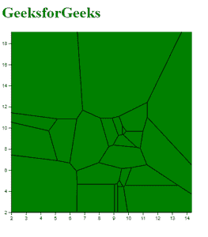

# D3.js voronoi()函数

> 原文:[https://www.geeksforgeeks.org/d3-js-voronoi-function/](https://www.geeksforgeeks.org/d3-js-voronoi-function/)

**D3.js** 中的 **d3.voronoi()函数**用于创建一个新的 voronoi 图布局，默认为 *x* 和 *y* 访问器和一个*空*范围。沃罗诺伊图是使用稍后可以指定的一组数据点绘制的。

**语法:**

```
d3.voronoi()

```

**参数:**此功能不接受任何参数。

下面的例子演示了 **d3.voronoi()** 函数:

**示例:**

## 超文本标记语言

```
<!DOCTYPE html>
<html>
<head>
  <script src=
"https://d3js.org/d3.v4.min.js">
  </script>
  <script src=
"https://d3js.org/d3-voronoi.v1.min.js">
  </script>
</head>
<body>
  <h1 style="color:green">
    GeeksforGeeks
  </h1>

  <script>

    // Import the CSV data for
    // specifying the Voronoi
    d3.csv("data.csv", 
           function (error, data) {
      var svg = d3.select("body")
        .append("svg")
        .attr("height", 400)
        .attr("width", 400)
        .append("g")
        .attr("transform",
              "translate(" + 20 +
              "," + -20 + ")");

      var y = d3.scaleLinear()
        .domain([2, 20])
        .range([400, 0]);
      var x = d3.scaleLinear()
        .domain([2, 15])
        .range([0, 400]);
      svg.append("g")
        .call(d3.axisLeft(y));

      svg.append("g")
        .attr("transform",
              "translate(0," + 400 + ")")
        .call(d3.axisBottom(x));

      // Using the d3.voronoi() function
      // to create a Voronoi diagram
      var voronoi = d3.voronoi()
        .x(function (d) { return x(d.x); })
        .y(function (d) { return y(d.y); })
        .extent([[0, 0], [400, 400]]);

      // Adding data to represent the Voronoi
      // and displaying it
      svg.append("g").selectAll("path")
        .data(voronoi(data).polygons())
        .enter()
        .append("path")
        .attr("d", (d) => 
              { return d ? 
                ("M" + d.join("L") +
                 "Z") : null; })
        .attr("fill", "green")
        .attr("stroke", "black");
    });
  </script>
</body>
</html>
```

**输出:**

