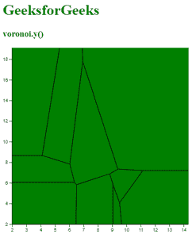
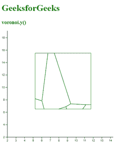

# D3.js voronoi.y()函数

> 原文:[https://www.geeksforgeeks.org/d3-js-voronoi-y-function/](https://www.geeksforgeeks.org/d3-js-voronoi-y-function/)

**voronoi.y()** 功能用于设置 y 坐标访问器。如果未指定 y，则该函数将当前 y 坐标访问器返回给 Voronoi 生成器函数。

**语法:**

```
d3.voronoi.y([y]);
```

**参数:**该函数取一个参数，如上所述，如下所述:

*   **y:** 是 y 坐标访问器的值。

**返回值:**这个函数不返回任何东西。

**注意:**请创建一个 data.csv 文件。文件的数据在下面的代码中给出。

下面给出了一些 Voronoi.y()函数的例子。

**例 1:**

```
<!DOCTYPE html> 
<html lang="en"> 

<head> 
    <meta charset="UTF-8"> 
    <meta name="viewport" content=" 
        width=device-width, initial-scale=1.0"> 

    <script type="text/javascript"
        src="https://d3js.org/d3.v4.min.js"> 
    </script>
    <script src="https://d3js.org/d3-voronoi.v1.min.js">
    </script>
</head> 

<body> 
    <h1 style="color:green">GeeksforGeeks</h1>
    <h3 style="color:green">voronoi.y()</h3>

    <script> 
        d3.csv("data.csv", function(error, data){
            var svg = d3.select("body")
                        .append("svg")
                        .attr("height", 400)
                        .attr("width", 400)
                        .append("g")
                        .attr("transform", "translate(
                 " + 20 + "," + -20 + ")");

            var y = d3.scaleLinear()
                      .domain([2,20])
                      .range([400,0]);
            var x = d3.scaleLinear()
                      .domain([2,15])
                      .range([0,400]);
            svg.append("g")
                    .call(d3.axisLeft(y));

            svg.append("g")
                    .attr("transform", "translate(0," + 400 + ")")
                    .call(d3.axisBottom(x));

            var voronoi = d3.voronoi()
                            .x(function(d) { return x(d.x); });
            // Use of voronoi.y() Function
                voronoi.y(function(d) { return y(d.y); })
                .extent([[0, 0], [400,400]]);

            svg.append("g").selectAll("path")
                .data(voronoi(data).polygons())
                .enter()
                .append("path")
                .attr("d",(d)=>{ return d ? (
          "M" + d.join("L") + "Z") : null; })

                .attr("fill","green")
                .attr("stroke","black");
        });

        // Data for CSV file
        // x,y,group
        // 45,4.4,H
        // 9.1,4.4,H
        // 9.9,9.9,H
        // 4.45,9.6,H
        // 4,7.6,H
        // 9,45,H
        // 4,9.7,H
        // 9.7,4.7,H
        // 9.9,4.5,H
        // 4,4.5,H
        // 7.9,9,H
        // 9.9,45,H
        // 9,4.4,H
    </script> 
</body> 

</html> 
```

**输出:**



**例 2:**

```
<!DOCTYPE html> 
<html lang="en"> 

<head> 
    <meta charset="UTF-8"> 
    <meta name="viewport" content=" 
        width=device-width, 
                initial-scale=1.0"> 

    <script type="text/javascript"
        src="https://d3js.org/d3.v4.min.js"> 
    </script>
    <script src=
"https://d3js.org/d3-voronoi.v1.min.js">
    </script>
</head> 

<body> 
    <h1 style="color:green">GeeksforGeeks</h1>
    <h3 style="color:green">voronoi.y()</h3>

    <script> 
        d3.csv("data.csv", function(error, data){
            var svg = d3.select("body")
                        .append("svg")
                        .attr("height", 400)
                        .attr("width", 400)
                        .append("g")
                        .attr("transform", 
                              "translate(
                  " + 20 + "," + -20 + ")");

            var y = d3.scaleLinear()
                      .domain([2,20])
                      .range([400,0]);
            var x = d3.scaleLinear()
                      .domain([2,15])
                      .range([0,400]);
            svg.append("g")
                    .call(d3.axisLeft(y));

            svg.append("g")
                .attr("transform", "translate(0," + 400 + ")")
                    .call(d3.axisBottom(x));

            var voronoi = d3.voronoi()
                            .x(function(d) { return x(d.x); });
            // Use of voronoi.y() Function
                voronoi.y(function(d) { return y(d.y); })
                // Setting the extent 
                .extent([[100, 100], [300,300]]);

            svg.append("g").selectAll("path")
                .data(voronoi(data).polygons())
                .enter()
                .append("path")
                .attr("d",(d)=>{ return d ? (
                "M" + d.join("L") + "Z") : null; })
                .attr("fill","none")
                .attr("stroke","green");
        });

        // Data for CSV file
        // x,y,group
        // 45,4.4,H
        // 9.1,4.4,H
        // 9.9,9.9,H
        // 4.45,9.6,H
        // 4,7.6,H
        // 9,45,H
        // 4,9.7,H
        // 9.7,4.7,H
        // 9.9,4.5,H
        // 4,4.5,H
        // 7.9,9,H
        // 9.9,45,H
        // 9,4.4,H
    </script> 
</body> 

</html> 
```

**输出:**

