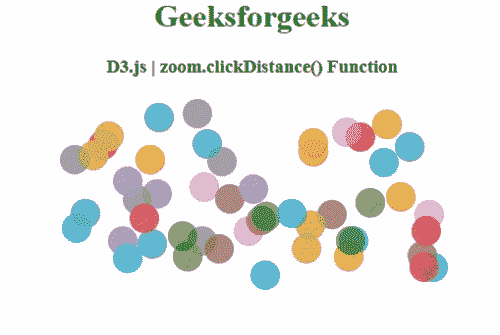
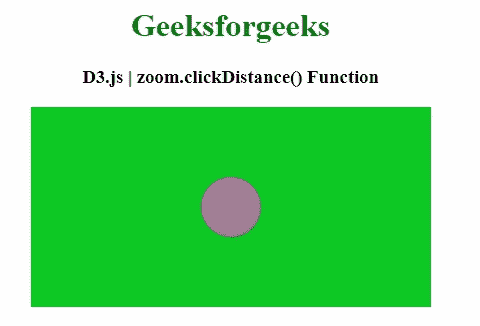

# D3.js 变焦.点击距离()功能

> 原文:[https://www . geesforgeks . org/D3-js-zoom-click distance-function/](https://www.geeksforgeeks.org/d3-js-zoom-clickdistance-function/)

**D3.js** 中的 **zoom.clickDistance()** 功能用于设置鼠标在鼠标向下和鼠标向上之间可以移动的最大距离，该距离将触发后续的点击事件。

**语法:**

```
zoom.clickDistance([distance])
```

**参数:**该函数接受一个参数，如上所述，如下所述

*   **距离:**此参数为最大距离。

**返回值:**该函数返回缩放行为。

以下程序说明了 **D3.js** 中的**缩放.点击距离()**功能

**例 1:**

```
<!DOCTYPE html> 
<html> 
<head> 
    <meta charset="utf-8">
    <script src="https://d3js.org/d3.v4.min.js"> 
    </script>

    <style>
        circle {
          opacity: 0.7;
        }
    </style>

</head> 

<body> 
    <center>
        <h1 style="color: green;"> 
            Geeksforgeeks 
        </h1> 

        <h3>D3.js | zoom.clickDistance() Function</h3>

        <svg></svg>

        <script>
            var radius = 15;
            var svg = d3.select('svg');  
            var dimension = document.body
                .getBoundingClientRect();

            var data = d3.range(0, 50).map(function () {
                return {
                x: getRandom(radius, 400 - radius),
                y: getRandom(radius, 200 - radius)
              }
            });

            var zoom = d3.zoom()
                .clickDistance(4)
                .on('zoom', function() {
                canvas.attr('transform', d3.event.transform);
              })

            var canvas = svg.attr('width', 400)
                .attr('height', 200)
                .call(zoom)
                .insert('g', ':first-child');

            canvas.selectAll('circle')
                .data(data)
                .enter()
                .append('circle')
                .attr('r', radius)
                .attr('cx', function(d) {
                    return d.x;})
                .attr('cy', function(d) {
                    return d.y;})
                .style('fill', function() {
      return d3.schemeCategory10[getRandom(0, 9)]
                });

            function getRandom(min, max) {
              min = Math.ceil(min);
              max = Math.floor(max);
              return Math.floor(
Math.random() * (max - min + 1)) + min;
            }
        </script> 
    </center>
</body> 

</html> 
```

**输出:**



**例 2:**

```
<!DOCTYPE html> 
<html> 
<head> 
    <meta charset="utf-8">
    <script src="https://d3js.org/d3.v4.min.js"> 
    </script>

    <style>
        circle {
          opacity: 0.7;
          fill: #e854c8;
        }
    </style>

</head> 

<body> 
    <center>
        <h1 style="color: green;"> 
            Geeksforgeeks 
        </h1> 

        <h3>
D3.js | zoom.clickDistance() Function
        </h3>

        <svg ></svg>

        <script>
            var transform = 
d3.zoomIdentity.translate(100, 0).scale(1);
            var zoom = d3.zoom().on("zoom", handleZoom);

            var svg = d3.select("svg")
              .attr('width', 400)
              .attr('height', 200)
              .style("background", "#0ec924")
              .call(zoom)                      
              .call(zoom.transform, transform);

            var zoomable = svg
              .append("g")
              .attr("class", "zoomable")
              .attr("transform", transform);   

            var circles = zoomable.append('circle')
              .attr("id", "circles")
              .attr("cx", 100)
              .attr("cy", 100)
              .attr('r', 30);

            function handleZoom(){
              if (zoomable) {
                zoomable.attr(
            "transform", d3.event.transform);
              }
            };

        </script> 
    </center>
</body> 

</html> 
```

**输出:**

