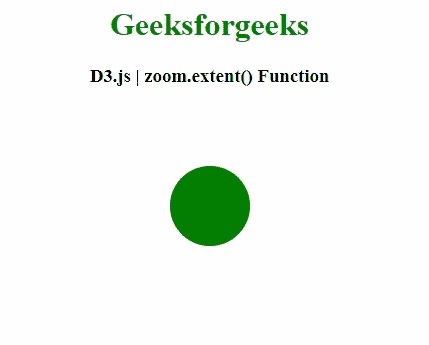
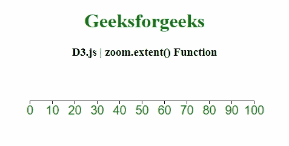

# D3.js 变焦.范围()功能

> 原文:[https://www.geeksforgeeks.org/d3-js-zoom-extent-function/](https://www.geeksforgeeks.org/d3-js-zoom-extent-function/)

**D3.js** 中的**缩放.范围()**功能用于将视口范围设置为指定的点阵列[左上角，右下角]。

**语法:**

```
zoom.extent([extent])
```

**参数:**该函数接受一个参数，如上所述，如下所述

*   **范围:**该参数可以定义为返回这样一个数组的函数。

**返回值:**该函数返回缩放行为。

以下程序说明了 **D3.js** 中的**缩放()**功能

**例 1:**

```
<!DOCTYPE html> 
<html> 
<head> 
    <meta charset="utf-8">

    <script src="https://d3js.org/d3.v4.min.js"> 
   </script>
</head> 

<body> 
    <center>
        <h1 style="color: green;"> 
            Geeksforgeeks 
        </h1> 

        <h3>D3.js | zoom.extent() Function</h3>

        <div id="GFG"></div>

        <script>
            var svg = d3.select("#GFG")
              .append("svg")
                .attr("width", 300)
                .attr("height", 200)
                .call(d3.zoom()
                .extent([[0, 0], [200, 200]])
                .on("zoom", function () {
                   svg.attr(
             "transform", d3.event.transform)
                }))
              .append("g")

            svg
              .append("circle")
                .attr("cx", 150)
                .attr("cy", 100)
                .attr("r", 40)
                .style("fill", "green")

        </script> 
    </center>
</body> 

</html> 
```

**输出:**



**例 2:**

```
<!DOCTYPE html> 
<html> 
<head> 
    <meta charset="utf-8">

    <script src="https://d3js.org/d3.v4.min.js"> 
    </script>

    <style>
        svg text {  
            fill: green;  
            font: 20px sans-serif;  
            text-anchor: center;  
        }  

        rect {
          pointer-events: all;
        }
    </style>

</head> 

<body> 
    <center>
        <h1 style="color: green;"> 
            Geeksforgeeks 
        </h1> 

        <h3>D3.js | zoom.extent() Function</h3>

        <svg></svg>

        <script>
            var width = 400;
            var height = 200;

            var svg = d3.select("svg")
              .attr("width", width)
              .attr("height", height);

            // The scale used to display the axis.
            var scale = d3.scaleLinear()
              .range([10, width-20])
              .domain([0, 100]);

            var shadowScale = scale.copy();

            var axis = d3.axisBottom()
              .scale(scale);

            var g = svg.append("g")
              .attr("transform", "translate(0, 50)")
              .call(axis);

            // Standard zoom behavior:
            var zoom = d3.zoom()
              .extent([[0, 0], [width, height]])
              .on("zoom", zoomed);

            // Call the Zoom.
            var rect = svg.append("rect")
              .attr("width", width)
              .attr("height", height)
              .attr("fill", "none")
              .call(zoom);

            function zoomed() {
              var t = d3.event.transform;
              scale.domain(t.rescaleX(shadowScale).domain());
              g.call(axis);
            }
        </script> 
    </center>
</body> 

</html>
```

**输出:**

