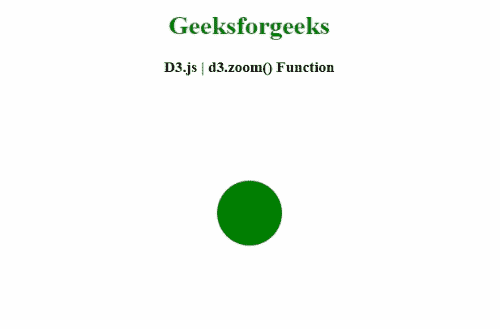
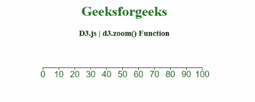

# D3.js 变焦()功能

> 原文:[https://www.geeksforgeeks.org/d3-js-zoom-function/](https://www.geeksforgeeks.org/d3-js-zoom-function/)

**D3.js** 中的 **d3.zoom()** 功能用于创建新的缩放行为。它用于对选定的元素应用缩放变换。

**语法:**

```
d3.zoom();
```

**参数:**此功能不接受任何参数。

**返回值:**该函数返回缩放行为。

以下程序说明了 **D3.js** 中的 **d3.zoom()** 功能

**示例 1:** 本例中，进行了缩放和平移。双击缩放，圆圈变大。

```
<!DOCTYPE html> 
<html> 
<head> 
    <meta charset="utf-8">
    <script src="https://d3js.org/d3.v4.min.js"> 
   </script>   
</head>  
<body> 
    <center>
        <h1 style="color: green;"> 
            Geeksforgeeks 
        </h1> 

        <h3>D3.js | d3.zoom() Function</h3>

        <div id="GFG"></div>

        <script>
            var svg = d3.select("#GFG")
              .append("svg")
                .attr("width", 300)
                .attr("height", 300)
                .call(d3.zoom().on("zoom", function () {
                   svg.attr("transform", d3.event.transform)
                }))
              .append("g")

            svg
              .append("circle")
                .attr("cx", 150)
                .attr("cy", 150)
                .attr("r", 40)
                .style("fill", "green")

        </script> 
    </center>
</body> 
</html> 
```

**输出:**


**例 2:**

```
<!DOCTYPE html> 
<html> 
<head> 
    <meta charset="utf-8">
    <script src="https://d3js.org/d3.v4.min.js"> 
    </script>
    <style>
        svg text {  
            fill: green;  
            font: 20px sans-serif;  
            text-anchor: center;  
        }  

        rect {
          pointer-events: all;
        }
    </style>
</head> 
<body> 
    <center>
        <h1 style="color: green;"> 
            Geeksforgeeks 
        </h1> 

        <h3>D3.js | d3.zoom() Function </h3>

        <svg></svg>

        <script>
            var width = 400;
            var height = 200;

            var svg = d3.select("svg")
              .attr("width", width)
              .attr("height", height);

            // The scale used to display the axis.
            var scale = d3.scaleLinear()
              .range([10, width-20])
              .domain([0, 100]);

            var shadowScale = scale.copy();

            var axis = d3.axisBottom()
              .scale(scale);

            var g = svg.append("g")
              .attr("transform", "translate(0, 50)")
              .call(axis);

            // Standard zoom behavior:
            var zoom = d3.zoom()
              .scaleExtent([1, 10])
              .translateExtent([[0, 0], [width, height]])
              .on("zoom", zoomed);

            // Call the Zoom.
            svg.call(zoom);
        </script> 
    </center>
</body> 
</html>
```

**输出:**

