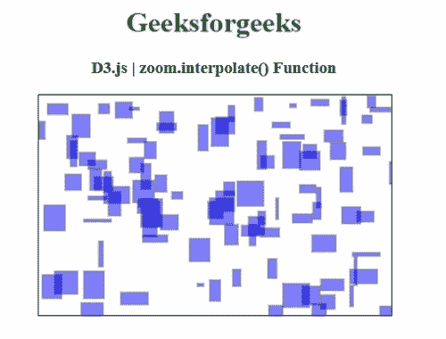
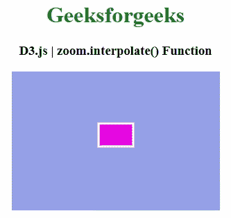

# D3 . js zoom . interpole()函数

> 原文:[https://www . geesforgeks . org/D3-js-zoom-INTERPOL-function/](https://www.geeksforgeeks.org/d3-js-zoom-interpolate-function/)

**D3.js** 库中的**缩放.插值()**功能用于将缩放过渡的插值工厂设置为指定功能。要在两个视图之间应用直接插值，请尝试 **d3 .插值**代替。

**语法:**

```
 zoom.interpolate([interpolate])

```

**参数:**该函数接受一个参数，如上所述，如下所述。

*   **插值:**该参数是缩放过渡的持续时间。

**返回值:**该函数返回缩放行为。

下面的程序说明了 **D3.js** 库中的**zoom . interpole()**功能。

**例 1:**

## 超文本标记语言

```
<!DOCTYPE html>
<html>

<head>
    <meta charset="utf-8">

    <script src=
        "https://d3js.org/d3.v5.js">
    </script>

    <style>
        rect {
            fill: blue;
            opacity: 0.5;
            stroke: black;
            stroke-width: 1px;
        }

        svg {
            border: 1px solid;
            font: 13px sans-serif;
        }
    </style>

</head>

<body>
    <center>
        <h1 style="color: green;">
            Geeksforgeeks
        </h1>

        <h3>D3.js | zoom.interpolate() Function</h3>

        <div id="GFG">
        </div>

        <script>
            var width = 400;
            var height = 250;
            var lengt = 30;

            var numrects = 100;
            var rects = [];

            for (var i = 0; i < numrects; i++)
                rects.push({
                    'x': 1 + Math.floor(Math.random() * width),
                    'y': 1 + Math.floor(Math.random() * height),
                    'h': 3 + Math.floor(Math.random() * lengt),
                    'w': 3 + Math.floor(Math.random() * lengt)
                });

            var zoomed = d3.zoom()
                .interpolate(d3.interpolate)
                .on('zoom', function (d) {
                    g.attr('transform',
                        d3.event.transform);
                });

            var svg = d3.select('#GFG')
                .append('svg')
                .attr('width', width)
                .attr('height', height)

            var g = svg.append('g')

            g.selectAll('rect')
                .data(rects)
                .enter()
                .append('rect')
                .attr('x', function (d) { return d.x; })
                .attr('y', function (d) { return d.y; })
                .attr('height', function (d) { return d.h; })
                .attr('width', function (d) { return d.w; })
                .classed('no-zoom', true)

            svg.call(zoomed);
        </script>
    </center>
</body>

</html>
```

**输出:**



**例 2:**

## 超文本标记语言

```
<!DOCTYPE html> 
<html> 
<head> 
    <meta charset="utf-8">
     <script src="https://d3js.org/d3.v4.min.js"> 
    </script>

    <script src=
    "https://cdnjs.cloudflare.com/ajax/libs/d3/5.7.0/d3.min.js">
    </script>

    <style>
        #svg {
            background-color: rgb(149, 160, 230);
        }
        #shape {
            fill: rgb(232, 7, 228);
            stroke: white;
            stroke-width: 3px;
        }
        #shape:hover {
            fill: rgb(13, 214, 30);
        }
    </style>
</head> 

<body> 
    <center>
        <h1 style="color: green;"> 
            Geeksforgeeks 
        </h1> 

        <h3>D3.js | zoom.interpolate() Function</h3>

        <div id="GFG"></div>

        <script>
            var width = 300,
              height = 200;

            var container = d3.select("#GFG").append("div");

            var svg = container.append("svg")
                .attr("id", "svg")
                .attr("width", width)
                .attr("height", height);

            var group = svg.append("g");

            var shape = group.append("rect")
                   .attr("id", "shape")
                   .attr("width", 50)
                   .attr("height", 33)
                   .attr("x", 125)
                   .attr("y", 75);

            zoom = d3.zoom()
              .interpolate([1, 3])
              .interpolate(d3.interpolateZoom)
              .translateExtent([[0, 0], [width, height]])
              .on("zoom", zoomed);

            svg.call(zoom);

            function zoomed() {
            change = d3.event.transform;
            group.attr("transform", "translate("
            + [change.x, change.y] + ")scale(" + change.k + ")")
            group.select("#shape").style("stroke-width", 
             (3 / change.k) + "px");
            }
        </script> 
    </center>
</body>    
</html>
```

**输出:**

