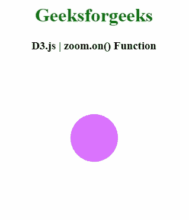
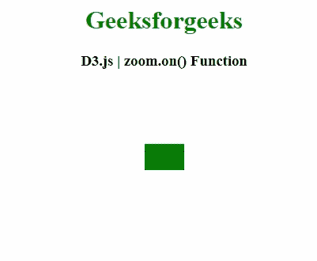

# D3.js zoom.on()功能

> 原文:[https://www.geeksforgeeks.org/d3-js-zoom-on-function/](https://www.geeksforgeeks.org/d3-js-zoom-on-function/)

**D3.js** 中的 **zoom.on()** 功能用于为指定的类型名称设置事件监听器，并返回缩放行为。如果已经为相同的类型和名称注册了事件侦听器，则在添加新的侦听器之前，将删除现有的侦听器。

**语法:**

```
zoom.on(typenames[, listener])
```

**参数:**该函数接受一个参数，如上所述，如下所述

*   **类型名:**此参数是包含一个或多个由空格分隔的类型名的字符串。
*   **监听器:**该参数为可选参数，为函数。

**返回值:**该函数返回缩放行为。

以下程序说明了 **D3.js** 中的**放大()**功能

**例 1:**

```
<!DOCTYPE html> 
<html> 
<head> 
    <meta charset="utf-8">

    <script src="https://d3js.org/d3.v4.min.js"> 
   </script> 

</head> 

<body> 
    <center>
        <h1 style="color: green;"> 
            Geeksforgeeks 
        </h1> 

        <h3>D3.js | zoom.on() Function</h3>

        <div id="GFG"></div>

        <script>
            var svg = d3.select("#GFG")
              .append("svg")
                .attr("width", 300)
                .attr("height", 250)
                .call(d3.zoom().on("zoom", function () {
                   svg.attr("transform", d3.event.transform)
                }))
              .append("g")

            svg
              .append("circle")
                .attr("cx", 150)
                .attr("cy", 125)
                .attr("r", 40)
                .style("fill", "#dc73ff")

        </script> 
    </center>
</body> 

</html> 
```

**输出:**



**例 2:**

```
<!DOCTYPE html> 
<html> 
<head> 
    <meta charset="utf-8">

    <script src="https://d3js.org/d3.v4.min.js"> 
   </script> 

</head> 

<body> 
    <center>
        <h1 style="color: green;"> 
            Geeksforgeeks 
        </h1> 

        <h3>D3.js | zoom.on() Function</h3>

        <div id="GFG"></div>

        <script>
            var svg = d3.select("#GFG")
                .append("svg")
                .attr("width", 300)
                .attr("height", 250)
                .call(d3.zoom().on("zoom", function () {
                    svg.attr("transform", d3.event.transform)
                }))
                .append("g")

            svg.append("rect")
                .attr("id", "shape")
                .attr("width", 50)
                .attr("height", 33)
                .attr("x", 125)
                .attr("y", 75)
                .style("fill", "green");

        </script> 
    </center>
</body> 

</html> 
```

**输出:**

