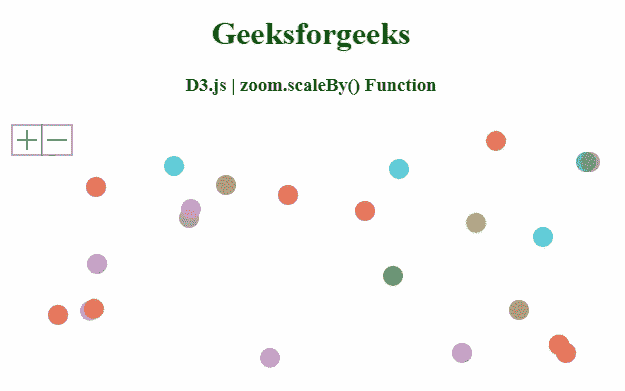
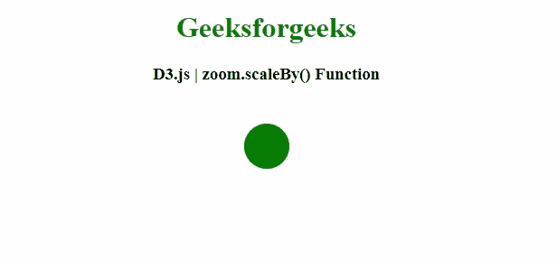

# D3.js zoom.scaleBy()功能

> 原文:[https://www.geeksforgeeks.org/d3-js-zoom-scaleby-function/](https://www.geeksforgeeks.org/d3-js-zoom-scaleby-function/)

**D3.js** 中的 **zoom.scaleBy()** 功能用于将所选元素的当前缩放变换缩放 k. 参考点 *p* 确实移动。

**语法:**

```
zoom.scaleBy(selection, k[, p])

```

**参数:**该功能接受三个参数，如上所述，描述如下:

*   **选择:**该参数可以是选择，也可以是过渡。
*   **k:** 该参数是一个比例因子，指定为数字或函数
*   **p:**p 的值没有指定，它的默认值是视口范围的中心。

**返回值:**该函数返回缩放行为。

以下程序说明了 **D3.js** 中的**缩放比()**功能

**例 1:**

## 超文本标记语言

```
<!DOCTYPE html> 
<html> 

<head> 
    <meta charset="utf-8">

    <script src=
        "https://d3js.org/d3.v4.min.js"> 
    </script>

    <style>
        circle {
          opacity: 0.7;
        }
        g.zoom-controls {
            cursor: pointer;
            pointer-events: all;
        }
        g.zoom-controls rect {
            fill: white;
            stroke: #596877;
            stroke-width: 1;
        }
        g.zoom-controls line {
            stroke: #596877;
            stroke-width: 2;
        }
    </style>
</head> 

<body> 
    <center>
        <h1 style="color: green;"> 
            Geeksforgeeks 
        </h1> 

        <h3>
            D3.js | zoom.scaleBy() Function
        </h3>

        <svg>

            <g class="zoom-controls" transform="translate(10, 10)">

                <g id="zoom-in" transform="translate(0, 0)">

                    <rect width="30" height="30"></rect>

                    <line x1="5" y1="15" x2="25" y2="15"></line>

                    <line x1="15" y1="5" x2="15" y2="25"></line>
                </g>

                <g id="zoom-out" transform="translate(30, 0)">

                    <rect width="30" height="30"></rect>

                    <line x1="5" y1="15" x2="25" y2="15"></line>

                </g>

            </g>

        </svg>

        <script>
            var radius = 10;
            var svg = d3.select('svg');  
            var dimension = document.body.getBoundingClientRect();

            var data = d3.range(0, 25).map(function() {
                return {
                x: getRandom(radius, dimension.width - radius),
                y: getRandom(radius, dimension.height - radius)
              }
            });

            var zoom = d3.zoom()
                .on('zoom', function() {
                canvas.attr('transform', d3.event.transform);
            });

            var canvas = svg
                .attr('width', dimension.width)
                .attr('height', dimension.height)
                .call(zoom)
                .insert('g', ':first-child');

            canvas.selectAll('circle')
                .data(data)
                .enter()
                .append('circle')
                .attr('r', radius)
                .attr('cx', function(d) {
                return d.x;
                }).attr('cy', function(d) {
                return d.y;
                }).style('fill', function() {
                return d3.schemeCategory10[getRandom(0, 9)]
                });

            d3.select('#zoom-in').on('click', function() {
                // Smooth zooming
                zoom.scaleBy(svg.transition().duration(750), 1.3);
            });

            d3.select('#zoom-out').on('click', function() {
                // Ordinal zooming
                zoom.scaleBy(svg, 1 / 1.3);
            });

            function getRandom(min, max) {
                min = Math.ceil(min);
                max = Math.floor(max);
                return Math.floor(Math.random() * (max - min + 1)) + min;
            }
        </script> 
    </center>
</body> 

</html>
```

**输出:**



**例 2:**

## 超文本标记语言

```
<!DOCTYPE html> 
<html> 
<head> 
    <meta charset="utf-8">

    <script src=
        "https://d3js.org/d3.v5.js">
    </script>

</head> 

<body> 
    <center>
        <h1 style="color: green;"> 
            Geeksforgeeks 
        </h1> 

        <h3>D3.js | zoom.scaleBy() Function</h3>

        <svg height="100px" width="100px"></svg>

        <script>
            const zoom_action = () => g.attr("transform", d3.event.transform);

            // Create the zoom handler
            const zoom = d3.zoom()
                    .on("zoom", zoom_action);

            // Get SVG element and apply zoom behaviour
            var svg = d3
              .select("svg")
              .call(zoom);

            // Create Group that will be zoomed
            var g = svg.append("g");

            // Create circle
            g.append("circle")
              .attr("cx",0)
              .attr("cy",0)
              .attr("r", 5)
              .style("fill","green");

            // Use of zoom.scaleBy Function
            zoom.scaleBy(svg, 5);
            zoom.translateBy(svg, 50, 50);

        </script> 
    </center>
</body> 

</html>
```

**输出:**

