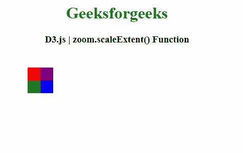
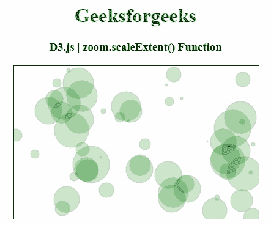

# D3 . js zoom . scale extend()函数

> 原文:[https://www . geesforgeks . org/D3-js-zoom-scale extend-function/](https://www.geeksforgeeks.org/d3-js-zoom-scaleextent-function/)

**D3.js** 中的**缩放范围()**功能用于设置扩展到指定数字数组[k0，k1]的比例。k0 是最小允许比例因子，k1 是最大允许比例因子

**语法:**

```
zoom.scaleExtent([extent])
```

**参数:**该函数接受一个参数，如上所述，如下所述

*   **范围:**该参数可以定义为返回这样一个数组的函数。

**返回值:**该函数返回缩放行为。

以下程序说明了 **D3.js** 中的**缩放范围()**功能

**例 1:**

```
<!DOCTYPE html> 
<html> 
<head> 
    <meta charset="utf-8">

    <script src="https://d3js.org/d3.v4.min.js"> 
    </script>

    <script src=
"https://cdnjs.cloudflare.com/ajax/libs/d3/3.4.11/d3.min.js">
    </script>

</head> 

<body> 
    <center>
        <h1 style="color: green;"> 
            Geeksforgeeks 
        </h1> 

        <h3>D3.js | zoom.scaleExtent() Function</h3>

        <svg height="200px" width="400px">
          <g id="main" transform="translate(25, 25) scale(0.25)"></g>
        </svg>

        <script>
            var svg = d3.select("#main");

            svg.append(
"rect").attr({"x":0, "y":0, "height":100, "width":100, "fill":"red"})
            svg.append(
"rect").attr({"x":100, "y":100, "height":100, "width":100, "fill":"blue"})
            svg.append(
"rect").attr({"x":0, "y":100, "height":100, "width":100, "fill":"green"})
            svg.append(
"rect").attr({"x":100, "y":0, "height":100, "width":100, "fill":"purple"})

            var zoom = d3.behavior.zoom().on("zoom", function(){
              var t = d3.event.translate;
              var s = d3.event.scale;

              svg.attr(
"transform", "translate("+t[0]+", "+t[1]+") scale("+s+")")

            })
            .scaleExtent([1, 10]).scale(1).translate([0, 0])

            d3.select("svg").call(zoom)

            d3.selectAll("rect").on("mousedown", function(){
              var scale = Math.random()*3;
              var translate = [Math.random()*100, Math.random()*100]
              zoom.scale(scale);
              zoom.translate(translate);

              //new transition
              var T = svg.transition().duration(5000)
              zoom.event(T);
            })
        </script> 
    </center>
</body> 

</html>
```

**输出:**



**例 2:**

```
<!DOCTYPE html> 
<html> 
<head> 
    <meta charset="utf-8">
    <script src="https://d3js.org/d3.v5.js">
    </script>

    <style>
        circle {
            fill: green;
            opacity: 0.2;
            stroke: black;
            stroke-width: 1px;
        }

        svg {
            border: 1px solid;
            font: 13px sans-serif;
            text-anchor: middle;
        }
    </style>

</head> 

<body> 
    <center>
        <h1 style="color: green;"> 
            Geeksforgeeks 
        </h1> 

   <h3>D3.js | zoom.scaleExtent() Function</h3>

        <div id="gfg" 
             style="width: 400px;
             margin: auto">
        </div>

        <script>
            function zoom_filter(divId) {
                var width = 400, height=250, maxR=30;

                var svg = d3.select(divId)
                            .append('svg')
                            .attr('width', width)
                            .attr('height', height)
                var g = svg.append('g')

                // create 15 circles
                var numCircles = 55;
                var circles = [];
                for (var i = 0; i < numCircles; i++)
                    circles.push(
{'x': 1+Math.floor(Math.random() * width),
              'y': 1+Math.floor(Math.random() * height),
              'r': 1+Math.floor(Math.random() * maxR)});

                g.selectAll('circle')
                    .data(circles)
                    .enter()
                    .append('circle')
                    .attr('cx', function(d) { return d.x; })
                    .attr('cy', function(d) { return d.y; })
                    .attr('r', function(d) { return d.r; })
                    .classed('no-zoom', true)

                var zoom = d3.zoom()
                    .scaleExtent([1, 10])
                    .on('zoom', function(d) { g.attr(
'transform', d3.event.transform); });

                svg.call(zoom);
            }
        </script> 

        <script>
            zoom_filter('#gfg');
        </script>
    </center>
</body> 

</html> 
```

**输出:**

