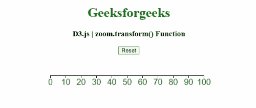
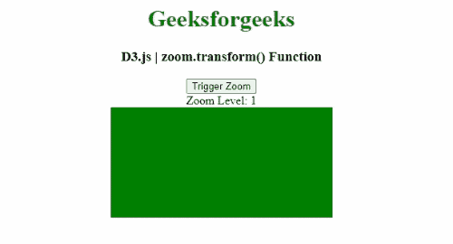

# D3.js zoom.transform()功能

> 原文:[https://www . geesforgeks . org/D3-js-zoom-transform-function/](https://www.geeksforgeeks.org/d3-js-zoom-transform-function/)

**D3.js** 中的 **zoom.transform()** 功能用于将所选元素的当前缩放变换设置为指定的变换。

**语法:**

```
zoom.transform(selection, transform[, point]);
```

**参数:**该功能接受如上所述的单个参数，描述如下:

*   **选择:**该参数可以是选择，也可以是过渡。
*   **变换:**该参数可定义为缩放变换或函数。

**返回值:**该函数返回缩放变换。

以下程序说明了 **D3.js** 中的**缩放.变换()**功能

**例 1:**

```
<!DOCTYPE html> 
<html> 
<head> 
    <meta charset="utf-8">
    <script src="https://d3js.org/d3.v4.min.js"> 
    </script> 
    <style>
        svg text {  
            fill: green;  
            font: 20px sans-serif;  
            text-anchor: center;  
        }  

        rect {
          pointer-events: all;
        }
    </style>
</head>  
<body> 
    <center>
        <h1 style="color: green;"> 
            Geeksforgeeks 
        </h1> 

        <h3>D3.js | zoom.transform() Function</h3>

        <button id="reset">Reset</button><br/>

        <svg></svg>

        <script>
            var width = 400;
            var height = 200;

            var svg = d3.select("svg")
              .attr("width", width)
              .attr("height", height);

            // The scale used to display the axis.
            var scale = d3.scaleLinear()
              .range([10, width-20])
              .domain([0, 100]);

            var shadowScale = scale.copy();

            var axis = d3.axisBottom()
              .scale(scale);

            var g = svg.append("g")
              .attr("transform", "translate(0, 50)")
              .call(axis);

            // Standard zoom behavior:
            var zoom = d3.zoom()
              .scaleExtent([1, 10])
              .translateExtent([[0, 0], [width, height]])
              .on("zoom", zoomed);

            // Call the Zoom.
            var rect = svg.append("rect")
              .attr("width", width)
              .attr("height", height)
              .attr("fill", "none")
              .call(zoom);

            d3.select("#reset")
              .on("click", function() {
                // Create an identity transform
                var transform = d3.zoomIdentity;

                // Apply the transform:
                rect.call(zoom.transform, transform);
              })
            function zoomed() {
              var t = d3.event.transform;
              scale.domain(t.rescaleX(shadowScale).domain());
              g.call(axis);
            }
        </script> 
    </center>
</body> 
</html>
```

**输出:**



**例 2:**

```
<!DOCTYPE html> 
<html> 
<head> 
    <meta charset="utf-8">    
    <script src="https://d3js.org/d3.v4.min.js"> 
    </script> 
    <style>
        rect {
          cursor: pointer;
        }
    </style>
</head> 
<body> 
    <center>
        <h1 style="color: green;"> 
            Geeksforgeeks 
        </h1> 

        <h3>D3.js | zoom.transform() Function</h3>

        <button>Trigger Zoom</button> <br/>
        <span> Zoom Level: </span>
        <span id="GFG"></span><br/>

        <svg></svg>

        <script>
            var scale = d3.scaleSqrt()  
                .range(["green", "purple", "blue"])
                .domain([1, 40, 1600]);

            var zoom = d3.zoom()        
                .on("zoom", zoomed)
                .scaleExtent([1, 1600])

            var rect = d3.select("svg")
                .append("rect")
                .attr("width", 400)
                .attr("height", 300)
                .attr("fill", "green")
                .call(zoom);

            rect.call(zoom.transform, d3.zoomIdentity);

            d3.select("button").on("click", function() {
                var newTransform = d3.zoomIdentity.scale(100);
                rect.call(zoom.transform, newTransform);
            })

            // Zoom function:
            function zoomed(){
              var k = d3.event.transform.k;
              rect.attr("fill", scale(k));
              d3.select("#GFG").text(k);
            }
        </script> 
    </center>
</body> 
</html> 
```

**输出:**

