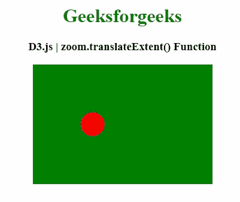
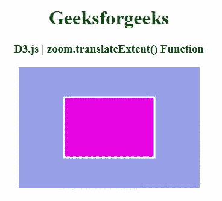

# D3 . js zoom . translateeextent()功能

> 原文:[https://www . geesforgeks . org/D3-js-zoom-translateextent-function/](https://www.geeksforgeeks.org/d3-js-zoom-translateextent-function/)

**D3.js** 中的**zoom . translateeextent()**功能用于将平移范围设置为指定的点数组[[左上角，右下角]]，并返回该缩放行为。

**语法:**

```
zoom.translateExtent([extent])
```

**参数:**该函数接受一个参数，如上所述，如下所述

*   **范围:**此参数用于将车轮增量功能设置为指定功能。

**返回值:**该函数返回缩放行为。

以下程序说明了 **D3.js** 中的**缩放.平移扩展()**功能

**例 1:**

```
<!DOCTYPE html> 
<html> 
<head> 
    <meta charset="utf-8">

    <script src=
            "https://d3js.org/d3.v4.min.js"> 
    </script>

    <script src=
"https://cdnjs.cloudflare.com/ajax/libs/d3/5.7.0/d3.min.js">
    </script>
</head> 

<body> 
    <center>
        <h1 style="color: green;"> 
            Geeksforgeeks 
        </h1> 

        <h3>
  D3.js | zoom.translateExtent() Function
      </h3>

        <div id="GFG"></div>

        <script>
            var height = 300;
            var width = 300;

            var zoom = d3.zoom()
               .translateExtent([[0, 0], [300, 300]])
                .on("zoom", zoomed);

            var svg = d3.select("#GFG")
                    .append("svg")
                    .attr("width", height)
                    .attr("height", width)
                    .append("g")

            svg.append("rect")
                    .attr("x", 0)
                    .attr("y", 0)
                    .attr("height", 200)
                    .attr("width", 400)
                    .style("fill", "green");

                var circle = svg.append("circle")
                    .attr("cx", 100)
                    .attr("cy", 100)
                    .attr("r", 20)
                    .style("fill", "red")

                svg.call(zoom);

                function zoomed() {
                  circle.attr(
                    "transform", d3.event.transform);
                }
        </script> 
    </center>
</body> 

</html>
```

**输出:**



**例 2:**

```
<!DOCTYPE html>
<html>
    <head>
        <meta charset="utf-8" />

        <script src=
            "https://d3js.org/d3.v4.min.js">
      </script>

        <script src=
"https://cdnjs.cloudflare.com/ajax/libs/d3/5.7.0/d3.min.js">
      </script>

        <style>
            #svg {
                background-color: rgb(149, 160, 230);
            }
            #shape {
                fill: rgb(232, 7, 228);
                stroke: white;
                stroke-width: 3px;
            }
            #shape:hover {
                fill: rgb(13, 214, 30);
            }
        </style>
    </head>

    <body>
        <center>
            <h1 style="color: green;">
                Geeksforgeeks
            </h1>

            <h3>D3.js | zoom.translateExtent() Function</h3>

            <div id="GFG"></div>

            <script>
                var width = 300,
                    height = 200;

                var container =
                    d3.select("#GFG").append("div");

                var svg = 
                    container.append(
                      "svg").attr(
                      "id", "svg").attr(
                      "width", width).attr(
                      "height", height);

                var group = svg.append("g");

                var shape = group.append(
                  "rect").attr(
                  "id", "shape").attr(
                  "width", 150).attr(
                  "height", 100).attr(
                  "x", 75).attr("y", 50);

                zoom = d3
                    .zoom()
                    .scaleExtent([1, 3])
                    .translateExtent([
                        [0, 0],
                        [width, height],
                    ])
                    .on("zoom", zoomed);

                svg.call(zoom);

                function zoomed() {
                    change = d3.event.transform;
                    console.log(change);
                    group.attr("transform", "translate(" +
                    [change.x, change.y] + ")scale(" + 
                    change.k + ")");
                    group.select("#shape").style(
                        "stroke-width", 3 / change.k + "px");
                }
            </script>
        </center>
    </body>
</html>
```

**输出:**

