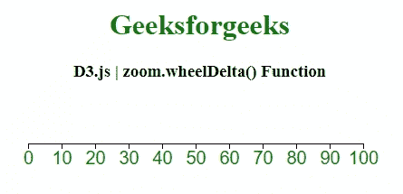
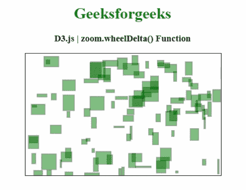

# D3.js zoom.wheelDelta()功能

> 原文:[https://www . geesforgeks . org/D3-js-zoom-wheel delta-function/](https://www.geeksforgeeks.org/d3-js-zoom-wheeldelta-function/)

**D3.js** 的 **zoom.wheelDelta()** 功能用于将 wheelDelta 功能设置为指定功能，并返回缩放行为。

**语法:**

```
zoom.wheelDelta([delta])

```

**参数:**该函数接受一个参数，如上所述，如下所述。

*   **增量:**此参数用于将车轮增量功能设置为指定功能。

**返回值:**该函数返回缩放行为。

以下程序说明了 **D3.js** 中的 **zoom.wheelDelta()** 功能

**例 1:**

## 超文本标记语言

```
<!DOCTYPE html> 
<html> 
<head> 
    <meta charset="utf-8">

    <script src="https://d3js.org/d3.v4.min.js"> 
    </script>

    <style>
        svg text {  
            fill: green;  
            font: 20px sans-serif;  
            text-anchor: center;  
        }  

        rect {
          pointer-events: all;
        }
    </style>

</head> 

<body> 
    <center>
        <h1 style="color: green;"> 
            Geeksforgeeks 
        </h1> 

        <h3>D3.js | zoom.wheelDelta() Function</h3>

        <svg></svg>

        <script>
            var width = 400;
            var height = 200;

            var svg = d3.select("svg")
              .attr("width",width)
              .attr("height",height);

            // The scale used to display the axis.
            var scale = d3.scaleLinear()
              .range([10,width-20])
              .domain([0,100]);

            var shadowScale = scale.copy();

            var axis = d3.axisBottom()
              .scale(scale);

            var g = svg.append("g")
              .attr("transform","translate(0,50)")
              .call(axis);

            // Standard zoom behavior:
            var zoom = d3.zoom()
              .scaleExtent([1,10])
              .translateExtent([[0, 0], [width, height]])
              .wheelDelta(myDelta)
              .on("zoom", zoomed);

            // Call the Zoom.
            var rect = svg.append("rect")
              .attr("width",width)
              .attr("height",height)
              .attr("fill","none")
              .call(zoom);

            function zoomed() {
              var t = d3.event.transform;
              scale.domain(t.rescaleX(shadowScale).domain());
              g.call(axis);
            }
            function myDelta() {
              return -d3.event.deltaY * 
             (d3.event.deltaMode ? 120 : 1) / 1500;
            }
        </script> 
    </center>
</body>   
</html>
```

**输出:**



**例 2:**

## 超文本标记语言

```
<!DOCTYPE html> 
<html> 
<head> 
    <meta charset="utf-8">

    <script src="https://d3js.org/d3.v5.js">
    </script>

    <style>
        rect {
            fill: green;
            opacity: 0.5;
            stroke: black;
            stroke-width: 1px;
        }

        svg {
            border: 1px solid;
            font: 13px sans-serif;
        }
    </style>

</head> 

<body> 
    <center>
        <h1 style="color: green;"> 
            Geeksforgeeks 
        </h1> 

        <h3>D3.js | zoom.wheelDelta() Function</h3>

        <div id="GFG">
        </div>

        <script>
                var width = 400;
                var height=250;
                var size=30;

                var svg = d3.select('#GFG')
                    .append('svg')
                    .attr('width', width)
                    .attr('height', height)

                var g = svg.append('g')

                var numrects = 100;
                var rects = [];
                for (var i = 0; i < numrects; i++)
                    rects.push({'x': 1 +
                         Math.floor(Math.random() * width),
                        'y': 1+Math.floor(Math.random() * height),
                        'h': 3+Math.floor(Math.random() * size),
                        'w': 3+Math.floor(Math.random() * size)
                    });

                g.selectAll('rect')
                    .data(rects)
                    .enter()
                    .append('rect')
                    .attr('x', function(d) { return d.x; })
                    .attr('y', function(d) { return d.y; })
                    .attr('height', function(d) { return d.h; })
                    .attr('width', function(d) { return d.w; })
                    .classed('no-zoom', true)

                var zoomed = d3.zoom()
                    .wheelDelta(myDelta)
                    .scaleExtent([1,10])
                    .on('zoom', function(d){ 
                        g.attr('transform', d3.event.transform); 
                    });

                svg.call(zoomed);
                function myDelta() {
              return d3.event.deltaY / 10;
            }
        </script>
    </center>
</body> 

</html>
```

**输出:**

