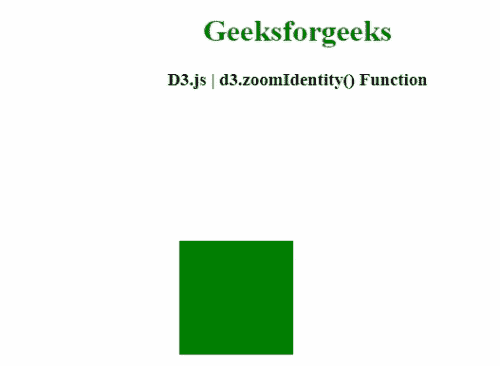

# D3.js zoomIdentity()函数

> 原文:[https://www.geeksforgeeks.org/d3-js-zoomidentity-function/](https://www.geeksforgeeks.org/d3-js-zoomidentity-function/)

**D3.js** 中的 **d3.zoomIdentity()** 函数用于获取身份变换，其中 k = 1，t<sub>x</sub>T6】=t<sub>y</sub>T10】= 0。

**语法:**

```
d3.zoomIdentity;

```

**参数:**此功能不接受任何参数。

**返回值:**该函数返回身份转换。

下面的程序说明了**D3 . js**中的 **d3.zoomIdentity()** 功能

**例 1:**

## 超文本标记语言

```
<!DOCTYPE html> 
<html>

<head> 
    <meta charset="utf-8">

    <script src=
        "https://d3js.org/d3.v4.min.js"> 
    </script>

    <style>
        svg text {  
            fill: green;  
            font: 20px sans-serif;  
            text-anchor: center;  
        }  

        rect {
          pointer-events: all;
        }
    </style>
</head> 

<body> 
    <center>
        <h1 style="color: green;"> 
            Geeksforgeeks 
        </h1> 

        <h3>D3.js | d3.zoomIdentity() Function</h3>

        <button id="reset">Reset</button><br/>

        <svg></svg>

        <script>
            var width = 400;
            var height = 200;

            var svg = d3.select("svg")
              .attr("width",width)
              .attr("height",height);

            // The scale used to display the axis.
            var scale = d3.scaleLinear()
              .range([10,width-20])
              .domain([0,100]);

            var shadowScale = scale.copy();

            var axis = d3.axisBottom()
              .scale(scale);

            var g = svg.append("g")
              .attr("transform","translate(0,50)")
              .call(axis);

            // Standard zoom behavior
            var zoom = d3.zoom()
              .scaleExtent([1,10])
              .translateExtent([[0, 0], [width, height]])
              .on("zoom", zoomed);

            // Calling the Zoom
            var rect = svg.append("rect")
              .attr("width",width)
              .attr("height",height)
              .attr("fill","none")
              .call(zoom);

            d3.select("#reset")
              .on("click", function() {

                // Creating an identity transform
                var transform = d3.zoomIdentity;

                // Applying the transform:
                rect.call(zoom.transform, transform);
              })

            function zoomed() {
              var t = d3.event.transform;
              scale.domain(t.rescaleX(shadowScale).domain());
              g.call(axis);
            }
        </script> 
    </center>
</body> 

</html>
```

**输出:**


**例 2:**

## 超文本标记语言

```
<!DOCTYPE html> 
<html> 

<head> 
    <meta charset="utf-8"> 

    <script src=
        "https://d3js.org/d3.v4.min.js"> 
    </script> 
</head> 

<body> 
    <center>
        <h1 style="color: green;"> 
            Geeksforgeeks 
        </h1> 

        <h3>D3.js | d3.zoomIdentity() Function</h3>

        <script>
            var svg = d3.select("body").append("svg")
               .attr("width", 400)
               .attr("height", 300);

            var g1 = svg.append("g");

            var zoom1 = d3.zoom().on("zoom", function() { 
               g1.attr("transform", d3.event.transform);
            });

            g1.call(zoom1.transform, d3.zoomIdentity  
                   .translate(150, 100)
                   .scale(2));

            g1.append("rect")
               .attr("x", 20)
               .attr("y", 20)
               .attr("width", 60)
               .attr("height", 60)
               .attr("fill","green");

            d3.selectAll("rect").on("click", function() {

               g1.transition()
                  .duration(3000)
                  .attr("transform", d3.zoomIdentity)
                  .on("end", function() {
                        d3.select(this)
                        .call(zoom1.transform, d3.zoomIdentity);   
                })
            });
        </script> 
    </center>
</body> 

</html>
```

**输出:**

