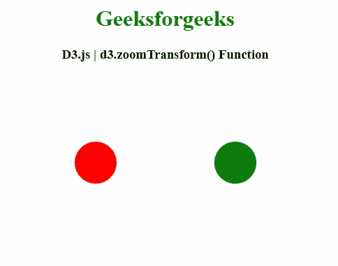
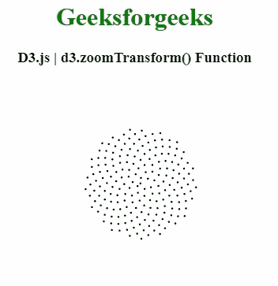

# D3.js zoomTransform()函数

> 原文:[https://www.geeksforgeeks.org/d3-js-zoomtransform-function/](https://www.geeksforgeeks.org/d3-js-zoomtransform-function/)

**D3.js** 中的 **d3.zoomTransform()** 函数用于获取指定节点的当前变换。

**语法:**

```
d3.zoomTransform(node)
```

**参数:**该函数接受一个参数，如上所述，如下所述

*   **节点:**该参数是接收输入事件的元素。

**返回值:**该函数返回变换后的缩放行为。

下面的程序说明了**D3 . js**中的 **d3.zoomTransform()** 功能

**例 1:**

```
<!DOCTYPE html> 
<html> 
<head> 
    <meta charset="utf-8">

    <script src="https://d3js.org/d3.v4.min.js"> 
   </script> 

</head> 

<body> 
    <center>
        <h1 style="color: green;"> 
            Geeksforgeeks 
        </h1> 

        <h3>D3.js | d3.zoomTransform() Function</h3>

        <svg width="400" height="250"></svg>

        <script>
            var svg = d3.select("svg"),
                width = +svg.attr("width"),
                height = +svg.attr("height");

            var radius = 30;    
            var circle1 = {x: 100, y: height /2 } ; 
            var circle2 = {x: 300, y: height /2 } ;

            var circle1 = svg.append("circle")
                .attr("cx", circle1.x)
                .attr("cy", circle1.y)
                .attr("r", radius)
                .attr("fill", "red");

            var circle2 = svg.append("circle")
                .attr("cx", circle2.x)
                .attr("cy", circle2.y)
                .attr("r", radius)
                .attr("fill", "green");

            //define zoom behaviour 
            var zoom_handler = d3.zoom()
                .on("zoom", zoom_actions);

            zoom_handler(circle2);

            function zoom_actions(){
             var transform = d3.zoomTransform(this);
             /* same as  this.setAttribute(
                "transform", "translate(" +
                 transform.x + ", " 
                 + transform.y + ") scale(
              " + transform.k + ")"); */
             this.setAttribute("transform", transform)
            }

        </script> 
    </center>
</body> 

</html> 
```

**输出:**



**例 2:**

```
<!DOCTYPE html> 
<html> 
<head> 
    <meta charset="utf-8">
    <script src="https://d3js.org/d3.v4.min.js"> 
   </script> 

</head> 

<body> 
    <center>
        <h1 style="color: green;"> 
            Geeksforgeeks 
        </h1> 

        <h3>D3.js | d3.zoomTransform() Function</h3>

        <canvas width="500" height="300"></canvas>

        <script>
           var canvas = d3.select("canvas"),
                context = canvas.node().getContext("2d"),
                width = canvas.property("width"),
                height = canvas.property("height"),
                radius = 2.5;

            var points = d3.range(200).map(phyllotaxis(10));

            canvas.call(d3.zoom()
                .scaleExtent([1 / 2, 4])
                .on("zoom", zoomed));

            drawPoints();

            var k = 1;

            function zoomed() {
              context.save();
              context.clearRect(0, 0, width, height);
              context.translate(d3.event.transform.x, d3.event.transform.y);
              context.scale(d3.event.transform.k, d3.event.transform.k);
              k = d3.event.transform.k;
              drawPoints();
              context.restore();
            }

            function drawPoints() {
              context.beginPath();
              points.forEach(drawPoint);
              context.fill();
            }

            function drawPoint(point) {
              context.moveTo(point[0] + radius, point[1]);
              context.arc(point[0], point[1], radius, 0, 2 * Math.PI);
            }

            function phyllotaxis(radius) {
              var theta = Math.PI * (3 - Math.sqrt(5));
              return function(i) {
                var r = radius * Math.sqrt(i), a = theta * i;
                return [
                  width / 2 + r * Math.cos(a),
                  height / 2 + r * Math.sin(a)
                ];
              };
            }
        </script> 
    </center>
</body> 

</html> 
```

**输出:**

