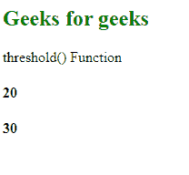
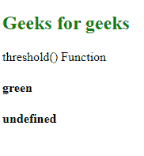

# D3 .比例阈值阈值()函数

> 原文:[https://www . geesforgeks . org/D3-scale threshold-threshold-function/](https://www.geeksforgeeks.org/d3-scalethreshold-threshold-function/)

d3.scaleThreshold 的 **threshold()** 函数当给定一个值作为来自指定域的输入时，会返回一个从给定的标度范围映射到它的值。

**语法:**

```
threshold(value);
```

**参数:**该函数只取一个参数，如上所述，如下所述。

*   **值:**它接受来自指定域的任何值。

**返回值:**该函数返回与给定输入值对应的指定范围内的值。

下面是上面给出的函数的几个例子。

**注意:**如果域有 n 个元素，那么范围必须总是包含 n+1 个元素。

**例 1:**

```
<!DOCTYPE html> 
<html lang="en"> 
<head> 
    <meta charset="UTF-8" /> 
    <meta name="viewport"
        path1tent="width=device-width, 
        initial-scale=1.0"/> 
    <script src=
    "https://d3js.org/d3.v4.min.js">
    </script> 
    <script src=
    "https://d3js.org/d3-color.v1.min.js">
    </script> 
    <script src=
    "https://d3js.org/d3-interpolate.v1.min.js">
    </script> 
    <script src=
"https://d3js.org/d3-scale-chromatic.v1.min.js">
    </script> 
</head> 
<body> 
    <h2 style="color:green;">
        Geeks for geeks
    </h2>
    <p>threshold() Function </p>
    <script> 
        var threshold = d3.scaleThreshold()
                    // Setting domain for the scale.
                    .domain([1, 2, 10, 3])
                    .range([10, 20, 30, 40, 50]);
        // Threshold function
        let val1=threshold(1);
        let val2=threshold(2);
        document.write("<h4>"+val1+"</h4>");
        document.write("<h4>"+val2+"</h4>");
    </script> 
</body> 
</html>
```

**输出:**

[](https://media.geeksforgeeks.org/wp-content/uploads/20200819231054/0176.png)

**例 2:**

```
<!DOCTYPE html> 
<html lang="en"> 
<head> 
    <meta charset="UTF-8" /> 
    <meta name="viewport"
        path1tent="width=device-width, 
        initial-scale=1.0"/> 
    <script src=
    "https://d3js.org/d3.v4.min.js">
    </script> 
    <script src=
    "https://d3js.org/d3-color.v1.min.js">
    </script> 
    <script src=
    "https://d3js.org/d3-interpolate.v1.min.js">
    </script> 
    <script src=
    "https://d3js.org/d3-scale-chromatic.v1.min.js">
    </script> 
</head> 
<body> 
    <h2 style="color:green;">Geeks for geeks</h2>
    <p>threshold() Function </p>
    <script> 
        var threshold = d3.scaleThreshold()
                    // Setting domain for the scale.
                    .domain([1, 2, 3, 4])
                    .range(["red", "green", "blue"]);
        // Threshold function
        let val1=threshold(1);
        let val2=threshold();
        document.write("<h4>"+val1+"</h4>");
        document.write("<h4>"+val2+"</h4>");
    </script> 
</body> 
</html>
```

**输出:**

[](https://media.geeksforgeeks.org/wp-content/uploads/20200819231319/0177.png)