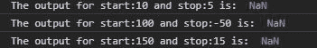
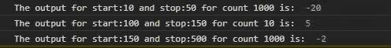

# d3.tickIncrement()函数

> 原文:[https://www.geeksforgeeks.org/d3-tickincrement-function/](https://www.geeksforgeeks.org/d3-tickincrement-function/)

D3.js 的 **tickIncrement()** 函数用于任何需要确保起点总是小于终点的情况，在该函数中起点和终点是作为参数给出的。如果给定的开始、停止和计数的刻度步长小于 1，则返回负的反向刻度步长。

**语法:**

```
d3.tickIncrement(start, stop, count)
```

**参数:**该函数接受三个参数，如上所述，描述如下。

*   **start:** 是从我们要数组元素的地方开始的起始值，是包含的。
*   **stop:** 是我们希望数组元素达到的起始值，是包含的。
*   **计数:**是给定起止范围内我们想要的元素数量。

**返回值:**返回一个整数。

**例 1:** 当开始大于停止时:

## 超文本标记语言

```
<!DOCTYPE html>
<html lang="en">

<head>
    <meta charset="UTF-8">
    <meta name="viewport" content=
        "width=device-width, initial-scale=1.0">
    <title>Document</title>
</head>

<body>
    <!--fetching from CDN of D3.js -->
    <script type="text/javascript"
        src="https://d3js.org/d3.v4.min.js">
    </script>

    <script>

        // What ever the count is it will
        // always give NaN as output because
        // stop is less than start
        let s = d3.tickIncrement(10, 5, 1);
        console.log("The output for start:10"
                    + " and stop:5 is: ", s);

        s = d3.tickIncrement(100, -50, 1);
        console.log("The output for start:100"
                    + " and stop:-50 is: ", s);

        s = d3.tickIncrement(100, 5, 1);
        console.log("The output for start:150"
                    + " and stop:15 is: ", s);
    </script>
</body>

</html>
```

**输出:**



**例 2:** 当刻度步长小于 1 时:

## 超文本标记语言

```
<!DOCTYPE html>
<html lang="en">

<head>
    <meta charset="UTF-8">
    <meta name="viewport" content=
        "width=device-width, initial-scale=1.0">
</head>

<body>
    <!--fetching from CDN of D3.js -->
    <script type="text/javascript"
        src="https://d3js.org/d3.v4.min.js">
    </script>

    <script>

        // If count is so large such that
        // the tick value is less than one
        // it gives the negative number
        let s = d3.tickIncrement(10, 50, 1000);
        console.log("The output for start:10 and"
            + " stop:50 for count 1000 is: ", s);

        s = d3.tickIncrement(100, 150, 10);
        console.log("The output for start:100 and"
            + " stop:150 for count 10 is: ", s);

        s = d3.tickIncrement(100, 500, 1000);
        console.log("The output for start:150 and"
            + " stop:500 for count 1000 is: ", s);
    </script>
</body>

</html>
```

**输出:**

