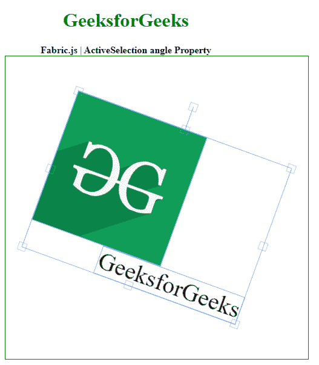

# 织物活性选举角度属性

> 原文:[https://www . geesforgeks . org/fabric-js-activeselection-angle-property/](https://www.geeksforgeeks.org/fabric-js-activeselection-angle-property/)

Fabric.js 是一个用于处理画布的 JavaScript 库。画布动态选举是 fabric.js 库的一个类，用于创建动态选举实例。画布活动选择意味着活动选择是可移动的，可以根据需要拉伸。在本文中，我们将使用*角度*属性来设置画布动态选择的角度。

首先导入 fabric.js 库。导入库后，在主体标签中创建一个包含动态选择的画布块。之后，初始化一个由 Fabric 提供的 Canvas 和 ActiveSelection 类的实例。JS 并使用*角度*属性设置角度。

**语法**:

```
fabric.ActiveSelection(ActiveSelection, {
angle : number
});
```

**参数**:该功能取一个参数，如上所述，如下所述。

*   **角度:**该参数取数值。它指定旋转角度。

**示例**:本示例使用 FabricJS 设置画布 ActiveSelection 的*角度*属性，如下例所示。

## 超文本标记语言

```
<!DOCTYPE html> 
<html> 

<head>
   <!-- FabricJS CDN -->
   <script src= 
"https://cdnjs.cloudflare.com/ajax/libs/fabric.js/3.6.2/fabric.min.js"> 
   </script> 
</head> 

<body> 
   <div style="text-align: center;width: 400px;"> 
      <h1 style="color: green;"> 
         GeeksforGeeks 
      </h1>
      <b> 
         Fabric.js | ActiveSelection angle Property 
      </b> 

   </div> 

   <div style="text-align: center;"> 
      <canvas id="canvas" width="500" height="500"
            style="border:1px solid green;"> 
      </canvas> 
   </div> 
   
   <script> 
      var canvas = new fabric.Canvas("canvas"); 

      // Getting the image 
      var img = document.getElementById('my-image'); 

      // Creating the image instance 
      var imgInstance = new fabric.Image(img, {
      }); 

      canvas.add(imgInstance); 

      var imgInstance = new fabric.IText('GeeksforGeeks', {
      });
      canvas.add(imgInstance);
      canvas.centerObject(imgInstance); 

         var activeSelect = new fabric.ActiveSelection(canvas.getObjects(), {
            angle : 20,
         });
         canvas.setActiveObject(activeSelect);
         canvas.requestRenderAll();
         canvas.centerObject(activeSelect); 

   </script> 
</body> 

</html>
```

**输出:**



角度属性