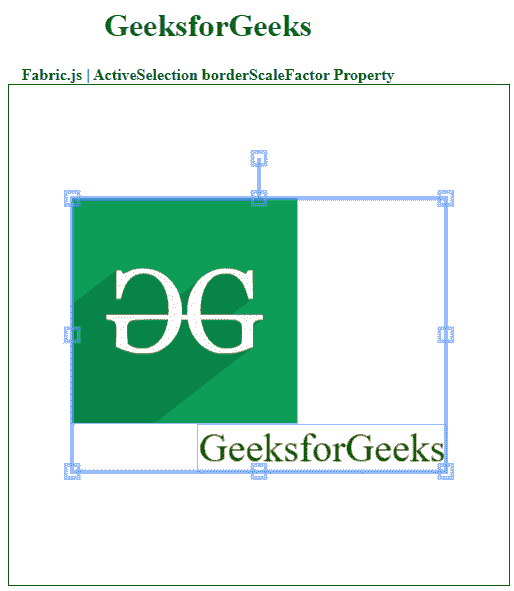

# 织物活性选举边界比例因子属性

> 原文:[https://www . geeksforgeeks . org/fabric-js-activeselection-borderscale factor-property/](https://www.geeksforgeeks.org/fabric-js-activeselection-borderscalefactor-property/)

Fabric.js 是一个用于处理画布的 JavaScript 库。画布**活动选择**是用于创建活动选择实例的 Fabric.js 类之一。画布活动选择意味着活动选择是可移动的，可以根据需要拉伸。在本文中，我们将使用**边框缩放因子**属性来设置画布动态选举的边框厚度。

**方法:**首先导入 Fabric.js 库。导入库后，在主体标签中创建一个包含动态选择的画布块。之后，初始化一个由 Fabric.js 提供的 Canvas 和 ActiveSelection 类的实例，并使用**边界缩放因子**属性来设置边界的厚度。

**语法:**

```html
fabric.ActiveSelection(ActiveSelection, {
  borderScaleFactor: number
});
```

**参数:**该函数采用如上所述的单个参数，如下所述。

*   **边界缩放因子:**该参数取一个数值。

**示例:**本示例使用 Fabric.js 设置画布 ActiveSelection 的 borderScaleFactor 属性。

## 超文本标记语言

```html
<!DOCTYPE html>
<html>

<head>
    <!-- FabricJS CDN -->
    <script src=
"https://cdnjs.cloudflare.com/ajax/libs/fabric.js/3.6.2/fabric.min.js">
    </script>
</head>

<body>
    <div style="text-align: center; width: 400px;">
        <h1 style="color: green;">
            GeeksforGeeks
        </h1>

        <b>
            Fabric.js | ActiveSelection borderScaleFactor Property
        </b>
    </div>

    <div style="text-align: center;">
        <canvas id="canvas" width="500" height="500"
            style="border:1px solid green;">
        </canvas>
    </div>

    

    <script>
        var canvas = new fabric.Canvas("canvas");

        // Getting the image 
        var img = document.getElementById('my-image');

        // Creating the image instance 
        var geek = new fabric.Image(img, {
        });

        canvas.add(geek);

        var geek = new fabric.IText('GeeksforGeeks', {
        });
        canvas.add(geek);
        canvas.centerObject(geek);

        var gfg = new fabric.ActiveSelection(
            canvas.getObjects(), {
            borderScaleFactor: 4
        });
        canvas.setActiveObject(gfg);
        canvas.requestRenderAll();
        canvas.centerObject(gfg);
    </script>
</body>

</html>
```

**输出:**

