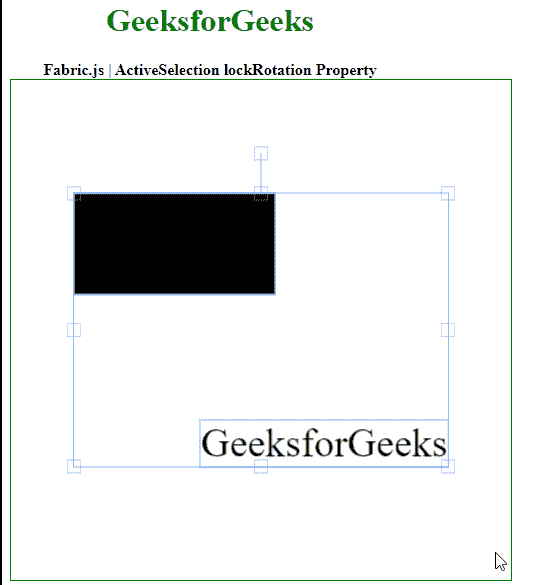

# Fabric.js ActiveSelection 锁定旋转属性

> 原文:[https://www . geesforgeks . org/fabric-js-activeselection-lock rotation-property/](https://www.geeksforgeeks.org/fabric-js-activeselection-lockrotation-property/)

Fabric.js 是一个用于处理画布的 JavaScript 库。画布动态选举是 fabric.js 的一个类，用于创建动态选举实例。画布活动选择意味着活动选择是可移动的，可以根据需要拉伸。在本文中，我们将使用锁定旋转属性来锁定旋转。

**方法:**首先导入 fabric.js 库。导入库后，在主体标签中创建一个包含动态选择的画布块。之后，初始化一个由 Fabric 提供的 Canvas 和 ActiveSelection 类的实例。JS 并使用 lockRotation 属性来锁定旋转。

**语法:**

```html
fabric.ActiveSelection(ActiveSelection, {
    lockRotation : boolean
});
```

**参数:**该函数采用如上所述的单个参数，描述如下:

*   **锁定旋转:**该参数取布尔值。

**示例:**本示例使用 FabricJS 设置画布 ActiveSelection 的 lockRotation 属性，如下例所示:

## 超文本标记语言

```html
<!DOCTYPE html>
<html>

<head>
    <!-- FabricJS CDN -->
    <script src=
"https://cdnjs.cloudflare.com/ajax/libs/fabric.js/3.6.2/fabric.min.js">
    </script>
</head>

<body>
    <div style="text-align: center;width: 400px;">
        <h1 style="color: green;">
            GeeksforGeeks
        </h1>
        <b>
            Fabric.js | ActiveSelection lockRotation Property
        </b>
    </div>

    <div style="text-align: center;">
        <canvas id="canvas" width="500" height="500" 
            style="border:1px solid green;">
        </canvas>
    </div>

    

    <script>
        var canvas = new fabric.Canvas("canvas");

        // Initiate a Rect instance  
        var rectangle = new fabric.Rect({
            width: 200,
            height: 100,
        });
        canvas.add(rectangle);

        var geek = new fabric.IText('GeeksforGeeks', {
        });
        canvas.add(geek);
        canvas.centerObject(geek);

        var gfg = new fabric.ActiveSelection(
            canvas.getObjects(), {
                lockRotation: true
            });
        canvas.setActiveObject(gfg);
        canvas.requestRenderAll();
        canvas.centerObject(gfg);
    </script>
</body>

</html>
```

**输出:**

