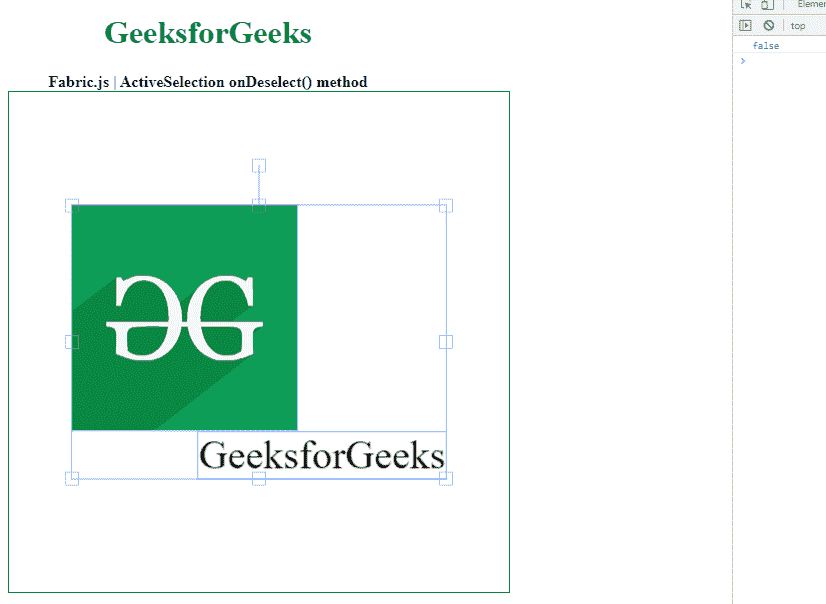

# fabric . js active selection on select()方法

> 原文:[https://www . geesforgeks . org/fabric-js-activeselection-on description-method/](https://www.geeksforgeeks.org/fabric-js-activeselection-ondeselect-method/)

在本文中，我们将看到如何使用 FabricJS 在画布 ActiveSelection 中使用 OnDescription()方法，它用于填充对象。画布活动选择意味着活动选择是可移动的，可以根据需要拉伸。此外，当涉及到初始笔画颜色、高度、宽度、填充颜色或笔画宽度时，可以自定义动态选择。

如果取消选择，onDeselect()方法返回真。

**方法:**首先导入 fabric.js 库。导入库后，在主体标签中创建一个包含动态选择的画布块。之后，初始化一个由 Fabric 提供的 Canvas 和 ActiveSelection 类的实例。JS 并使用 on description()方法。

**语法:**

```
ActiveSelection.onDeselect()
```

**参数:**:本功能不取任何参数。

**返回值:**如果取消选择，该方法返回返回真的对象值。

**示例:**本示例使用 FabricJS 设置画布 ActiveSelection 的 onDeselect()方法，如下例所示。

## 超文本标记语言

```
<!DOCTYPE html> 
<html> 

  <head>
    <!-- FabricJS CDN -->
    <script src= 
"https://cdnjs.cloudflare.com/ajax/libs/fabric.js/3.6.2/fabric.min.js"> 
    </script> 
  </head> 

  <body> 
    <div style="text-align: center;width: 400px;"> 
      <h1 style="color: green;"> 
        GeeksforGeeks 
      </h1>
      <b> 
        Fabric.js | ActiveSelection onDeselect() method 
      </b> 

    </div> 

    <div style="text-align: center;"> 
      <canvas id="canvas" width="500" height="500"
              style="border:1px solid green;"> 
      </canvas> 
    </div> 
    
    <script> 
      var canvas = new fabric.Canvas("canvas"); 

      // Getting the image 
      var img = document.getElementById('my-image'); 

      // Creating the image instance 
      var geek = new fabric.Image(img, {
      }); 

      canvas.add(geek); 

      var geek = new fabric.IText('GeeksforGeeks', {
      });
      canvas.add(geek);
      canvas.centerObject(geek); 

      var gfg = new fabric.ActiveSelection(canvas.getObjects(), {
      });
      canvas.setActiveObject(gfg);
      canvas.requestRenderAll();
      canvas.centerObject(gfg);
      console.log(gfg.onDeselect()) 

    </script> 
  </body> 

</html>
```

**输出:**


**参考:**[http://fabricjs.com/docs/fabric.选择](http://fabricjs.com/docs/fabric.ActiveSelection.html#onDeselect)