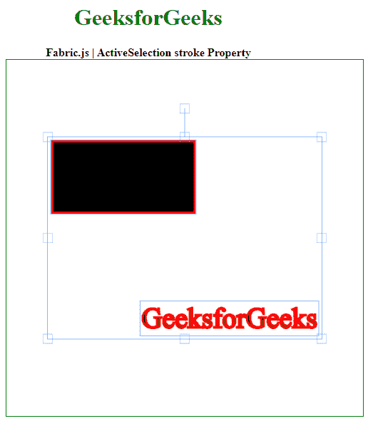

# 织物活性选举笔画属性

> 原文:[https://www . geesforgeks . org/fabric-js-activeselection-stroke-property/](https://www.geeksforgeeks.org/fabric-js-activeselection-stroke-property/)

**Fabric.js** 是一个用来处理画布的 JavaScript 库。画布动态选举是用于创建动态选举实例的 **fabric.js** 类之一。画布活动选择意味着活动选择是可移动的，可以根据需要拉伸。在本文中，我们将使用*笔画*属性来设置画布动态选举的笔画颜色。

**方法:**首先导入 **fabric.js** 库。导入库后，在主体标签中创建一个包含动态选择的画布块。之后，初始化由**织物提供的画布和活动选择类的实例。JS** 并使用*描边*属性设置画布 ActiveSelection 的描边颜色。

**语法:**

```html
fabric.ActiveSelection(ActiveSelection, {
  stroke: string
});
```

**参数:**该函数采用如上所述的单个参数，如下所述。

*   **笔画:**该参数取字符串值。

**示例:**本示例使用 **FabricJS** 设置画布 ActiveSelection 的*描边*属性，如下例所示。

## 超文本标记语言

```html
<!DOCTYPE html>
<html>

<head>
    <!-- FabricJS CDN -->
    <script src=
"https://cdnjs.cloudflare.com/ajax/libs/fabric.js/3.6.2/fabric.min.js">
    </script>
</head>

<body>
    <div style="text-align: center;width: 400px;">
        <h1 style="color: green;">
            GeeksforGeeks
        </h1>
        <b>
            Fabric.js | ActiveSelection stroke Property
        </b>
    </div>

    <div style="text-align: center;">
        <canvas id="canvas" width="500" height="500"
            style="border:1px solid green;">
        </canvas>
    </div>
    

    <script>
        var canvas = new fabric.Canvas("canvas");

        // Initiate a Rect instance  
        var rectangle = new fabric.Rect({
            width: 200,
            height: 100,
            stroke: 'red',
            strokeWidth: 3
        });
        canvas.add(rectangle);

        var itext = new fabric.IText('GeeksforGeeks', {
            stroke: 'red',
            strokeWidth: 3
        });
        canvas.add(itext);
        canvas.centerObject(itext);

        var activeSelect = new fabric
            .ActiveSelection(canvas.getObjects(), {
                stroke: 'red',
                strokeWidth: 9
            })
        canvas.setActiveObject(activeSelect);
        canvas.requestRenderAll();
        canvas.centerObject(activeSelect);
    </script>
</body>

</html>
```

**输出:**

