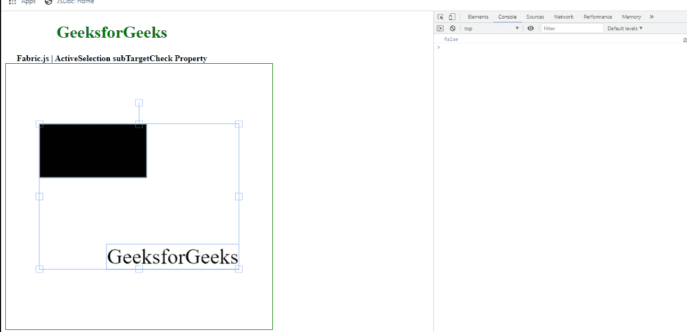

# Fabric.js ActiveSelection 子目标检查属性

> 原文:[https://www . geesforgeks . org/fabric-js-activeselection-subtargetcheck-property/](https://www.geeksforgeeks.org/fabric-js-activeselection-subtargetcheck-property/)

Fabric.js 是一个与 canvas 一起使用的 JavaScript 库。画布动态选举是用于创建动态选举实例的 fabric.js 类之一。画布活动选择意味着活动选择是可移动的，可以根据需要拉伸。在本文中，我们将使用 subTargetCheck 属性。

**接近**:首先导入 fabric.js 库。导入库后，在主体标签中创建一个包含动态选择的画布块。之后，初始化一个由 Fabric 提供的 Canvas 和 ActiveSelection 类的实例。JS 并使用 subTargetCheck 属性。

**语法**:

```
fabric.ActiveSelection(ActiveSelection, {
    subTargetCheck : boolean
});
```

**参数**:该功能取单个参数，如上所述，描述如下:

*   **子目标勾选**:该参数取布尔值。

**示例**:本示例使用 FabricJS 设置画布 ActiveSelection 的 subTargetCheck 属性，如下例所示:

## 超文本标记语言

```
<!DOCTYPE html>
<html>

<head>
    <!-- FabricJS CDN -->
    <script src=
"https://cdnjs.cloudflare.com/ajax/libs/fabric.js/3.6.2/fabric.min.js">
    </script>
</head>

<body>
    <div style="text-align: center;width: 400px;">
      <h1 style="color: green;">
          GeeksforGeeks
      </h1>
      <b>
          Fabric.js | ActiveSelection 
          subTargetCheck Property
      </b>
    </div>

    <div style="text-align: center;">
      <canvas id="canvas" width="500" 
        height="500" style="border:1px solid green;">
      </canvas>
    </div>

    

    <script>
      var canvas = new fabric.Canvas("canvas");

      // Initiate a Rect instance  
      var rectangle = new fabric.Rect({
          width: 200,
          height: 100,
      });
      canvas.add(rectangle);

      var geek = new fabric.IText('GeeksforGeeks', {
      });
      canvas.add(geek);
      canvas.centerObject(geek);

      var gfg = new fabric.ActiveSelection(canvas.getObjects(), {
      });
      console.log(gfg.subTargetCheck)
      canvas.setActiveObject(gfg);
      canvas.requestRenderAll();
      canvas.centerObject(gfg); 
    </script>
</body>

</html>
```

**输出:**

