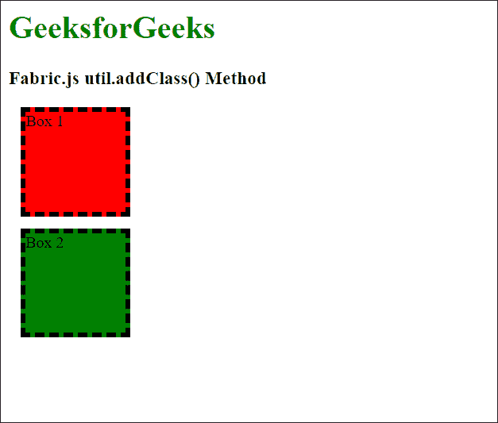

# Fabric.js addClass()方法

> 原文:[https://www.geeksforgeeks.org/fabric-js-addclass-method/](https://www.geeksforgeeks.org/fabric-js-addclass-method/)

Fabric.js 中的 **addClass()方法**用于将指定的类添加到指定的 HTML 元素中。必须首先选择页面中的 HTML 元素才能传递此方法。

**语法:**

```
addClass(element, className)
```

**参数:**该方法接受两个参数，如上所述，如下所述:

*   **元素:**此参数用于指定要添加类的 HTML 元素。
*   **类名:**此参数用于指定必须添加到元素中的类。

下面的例子演示了 Fabric.js 中的 **addClass()** 方法:

**示例:**

## 超文本标记语言

```
<!DOCTYPE html>
<html>

<head>

    <!-- Adding the Fabric.js library -->
    <script src=
"https://cdnjs.cloudflare.com/ajax/libs/fabric.js/3.6.2/fabric.min.js">
    </script>

    <style>

        /* Define the CSS classes to be used */
        .box1 {
            margin: 12px;
            width: 100px;
            height: 100px;
            background-color: red;
        }

        .box2 {
            margin: 12px;
            width: 100px;
            height: 100px;
            background-color: green;
        }

        .border {
            border: 5px dashed;
        }
    </style>
</head>

<body>
    <h1 style="color: green;">
        GeeksforGeeks
    </h1>
    <h3>
        Fabric.js util.addClass() Method
    </h3>

    <div id="box1">Box 1</div>
    <div id="box2">Box 2</div>

    <script>

        // Select the element that has
        // to be applied the classes
        let elem =
            document.querySelector('#box1');
        let elem2 =
            document.querySelector('#box2');

        // Add the required classes
        // to the element
        fabric.util.addClass(elem, 'box1');
        fabric.util.addClass(elem, 'border');

        fabric.util.addClass(elem2, 'box2');
        fabric.util.addClass(elem2, 'border');
    </script>
</body>

</html>
```

**输出:**

