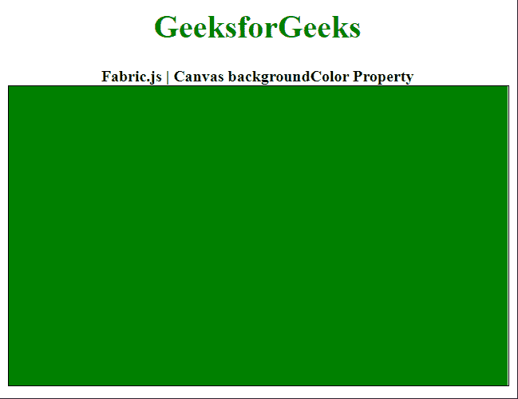

# 布艺. js 帆布背景色属性

> 原文:[https://www . geesforgeks . org/fabric-js-canvas-background color-property/](https://www.geeksforgeeks.org/fabric-js-canvas-backgroundcolor-property/)

在本文中，我们将看到如何使用 **backgroundColor** 属性设置 **Fabric.js** 中**画布**的背景颜色。Fabric.js 中的 canvas 用作 HTML 提供的本机 Canvas 对象的包装器。它提供了对底层画布的高级访问，允许它有一个对象模型，允许解析 SVG 文件，并允许以直观的方式与画布交互。

**方法:**为了实现这一点，我们将使用一个名为 **Fabric.js** 的 JavaScript 库。导入库后，我们将在 body 标签中创建画布块。之后，我们将初始化由 **Fabric.js** 提供的 Canvas 对象的一个实例，并使用 **backgroundColor** 属性更改 Canvas 的背景颜色。

**语法:**

```
fabric.Canvas(canvasElement, {
    backgroundColor: String
});
```

**参数:**该属性接受如上所述的单个参数，如下所述:

*   **backgroundColor:** 是指定画布背景颜色的字符串。

下面的例子说明了在 JavaScript 中使用 fabric . js Canvas**background color**属性:

**示例:**

## 超文本标记语言

```
<!DOCTYPE html>
<html>

<head>
    <!-- Adding the FabricJS library -->
    <script src=
"https://cdnjs.cloudflare.com/ajax/libs/fabric.js/3.6.2/fabric.min.js">
    </script>
</head>

<body>
    <div style="text-align: center; width: 500px;">
        <h1 style="color: green;">
            GeeksforGeeks
        </h1>

        <b>
            Fabric.js | Canvas backgroundColor Property
        </b>
    </div>

    <canvas id="canvas" width="500" height="300"
        style="border:1px solid #000000">
    </canvas>

    <script>

        // Initiate a Canvas instance 
        var canvas = new fabric.Canvas("canvas", {

            // Set the background color 
            // of the Canvas
            backgroundColor: "green"
        });
    </script>
</body>

</html>
```

**输出:**

