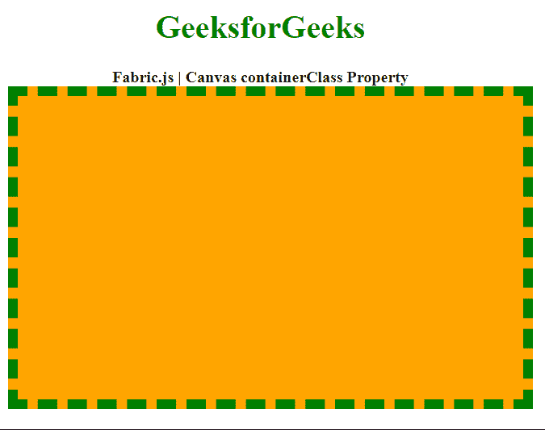

# 织物. js 帆布容器类属性

> 原文:[https://www . geesforgeks . org/fabric-js-canvas-container class-property/](https://www.geeksforgeeks.org/fabric-js-canvas-containerclass-property/)

在本文中，我们将看到如何使用 *containerClass* 属性设置 **Fabric.js** 中**画布**的包装类。**fabric . js 中的画布被用作 HTML 提供的原生画布对象的包装器。它提供了对底层画布的高级访问，允许它有一个对象模型，允许解析 SVG 文件，并允许画布以直观的方式交互。**

****方法:**为了实现这一点，我们将使用一个名为 **Fabric.js** 的 JavaScript 库。导入库后，我们将在 body 标签中创建画布块。我们还将在 CSS 中创建类，该类将用作画布的包装器。之后，我们将初始化由 **Fabric.js** 提供的画布对象的一个实例，并使用 *containerClass* 属性设置画布的包装类。**

****语法:****

```html
fabric.Canvas(canvasElement, {
    containerClass: String
});
```

****参数:**该属性接受一个参数，如上所述，如下所述。**

*   ****containerClass:** 它是一个字符串，指定要在画布上使用的包装类的名称。**

****示例:**下面的示例说明了在 JavaScript 中使用 fabric . js Canvas*container class*属性。**

## **超文本标记语言**

```html
<!DOCTYPE html>
<html>

<head>
    <!-- Adding the FabricJS library -->
    <script src=
"https://cdnjs.cloudflare.com/ajax/libs/fabric.js/3.6.2/fabric.min.js">
    </script>

    <style>

        /* Define the class to be used
        as the wrapper of the Canvas */
        .myClass {
            border: 10px dashed green;
            background-color: orange;
        }
    </style>
</head>

<body>
    <div style="text-align: center;
              width: 500px;">
        <h1 style="color: green;">
            GeeksforGeeks
        </h1>

        <b>
            Fabric.js | Canvas containerClass Property
        </b>
    </div>

    <canvas id="canvas" width="500" height="300">
    </canvas>

    <script>

        // Initiate a Canvas instance 
        let canvas = new fabric.Canvas("canvas", {
            // Set the wrapper class
            // of the Canvas
            containerClass: "myClass"
        });
    </script>
</body>

</html>
```

****输出:****

****