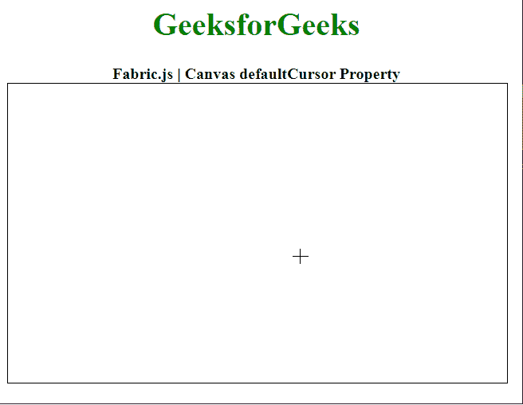

# Fabric.js 画布默认光标属性

> 原文:[https://www . geesforgeks . org/fabric-js-canvas-defaultcursor-property/](https://www.geeksforgeeks.org/fabric-js-canvas-defaultcursor-property/)

在本文中，我们将了解如何使用*默认光标* 属性在**织物. js** 中设置**画布的默认光标。****fabric . js**中的画布被用作 HTML 提供的原生画布对象的包装器。它提供了对底层画布的高级访问，允许它有一个对象模型，允许解析 SVG 文件，并允许以直观的方式与画布交互。****

****方法:**为了实现这一点，我们将使用一个名为 **Fabric.js** 的 JavaScript 库。导入库后，我们将在 body 标签中创建画布块。之后，我们将初始化由 **Fabric.js** 提供的画布对象的一个实例，并使用 *defaultCursor* 属性设置画布的默认光标。**

****语法:****

```html
fabric.Canvas(canvasElement, {
    defaultCursor: String
});
```

****参数:**该属性接受一个参数，如上所述，如下所述。**

*   ****默认光标:**它是一个字符串，指定要在画布上使用的默认光标的名称。**

****示例:**下面的示例说明了在 JavaScript 中使用 fabric . js Canvas*default cursor***属性。****

## ****超文本标记语言****

```html
**<!DOCTYPE html>
<html>

<head>
    <!-- Adding the FabricJS library -->
    <script src=
"https://cdnjs.cloudflare.com/ajax/libs/fabric.js/3.6.2/fabric.min.js">
    </script>
</head>

<body>
    <div style="text-align: center; 
              width: 500px;">
        <h1 style="color: green;">
            GeeksforGeeks
        </h1>
        <b>
            Fabric.js | Canvas defaultCursor Property
        </b>
    </div>

    <canvas id="canvas" width="500" height="300" 
        style="border:1px solid #000000">
    </canvas>

    <script>

        // Initiate a Canvas instance 
        var canvas = new fabric.Canvas("canvas", {

            // Set the default cursor
            // of the Canvas
            defaultCursor: "crosshair"
        });
    </script>
</body>

</html>**
```

******输出:******

********