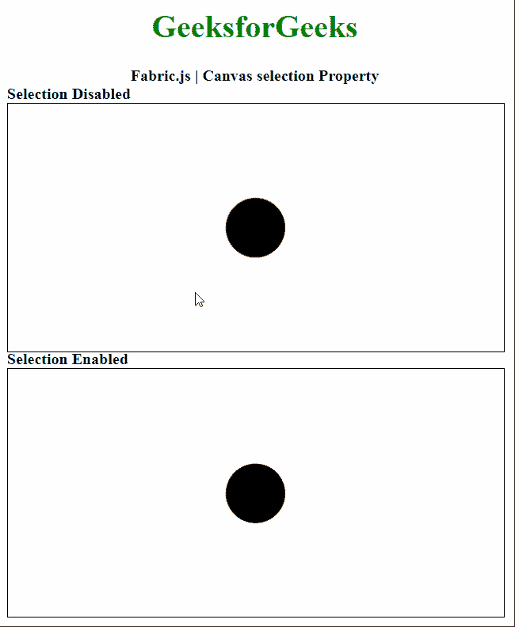

# Fabric.js 画布选择属性

> 原文:[https://www . geesforgeks . org/fabric-js-canvas-selection-property/](https://www.geeksforgeeks.org/fabric-js-canvas-selection-property/)

在本文中，我们将了解如何使用*选择*属性启用或禁用在**织物. js** 中的**画布**中选择对象。****fabric . js I**中的画布用作 HTML 提供的本机画布对象的包装器。它提供了对底层画布的高级访问，允许它有一个对象模型，允许解析 SVG 文件，并允许以直观的方式与画布交互。**

****方法:**为了实现这一点，我们将使用一个名为 **Fabric.js** 的 JavaScript 库。导入库后，我们将在 body 标签中创建画布块。之后，我们将初始化由 **Fabric.js** 提供的画布对象的一个实例，并使用*选择*属性设置画布所需的选择模式。**

****语法:****

```html
fabric.Canvas(canvasElement, {
    selection: Boolean
});
```

****参数:**该属性接受一个参数，如上所述，如下所述。**

*   ****选择:**是一个布尔值，指定是否应该在画布上启用对象的选择。**

****示例:**下面的示例说明了在 JavaScript 中使用 Fabric.js Canvas *选择*属性。**

## **超文本标记语言**

```html
<!DOCTYPE html>
<html>

<head>
    <!-- Adding the FabricJS library -->
    <script src=
"https://cdnjs.cloudflare.com/ajax/libs/fabric.js/3.6.2/fabric.min.js">
    </script>
</head>

<body>
    <div style="text-align: center;
              width: 500px;">
        <h1 style="color: green;">
            GeeksforGeeks
        </h1>

        <b>
            Fabric.js | Canvas selection Property
        </b>
    </div>

    <b>Selection Disabled</b>
    <canvas id="canvas" width="500" height="250" 
        style="border:1px solid #000000">
    </canvas>

    <b>Selection Enabled</b>
    <canvas id="canvas2" width="500" height="250" 
        style="border:1px solid #000000">
    </canvas>

    <script>

        let circle = new fabric.Circle({
            radius: 30,
        });

        let circle2 = new fabric.Circle({
            radius: 30,
        });

        // Initiate a Canvas instance 
        let canvas = new fabric.Canvas("canvas", {

            // Disable selection
            // in this Canvas
            selection: false
        });

        // Initiate a Canvas instance 
        let canvas2 = new fabric.Canvas("canvas2", {

            // Enable selection
            // in this Canvas
            selection: true
        });

        canvas.add(circle);
        canvas.centerObject(circle);
        canvas2.add(circle2);
        canvas2.centerObject(circle2);
    </script>
</body>

</html>
```

****输出:****

****