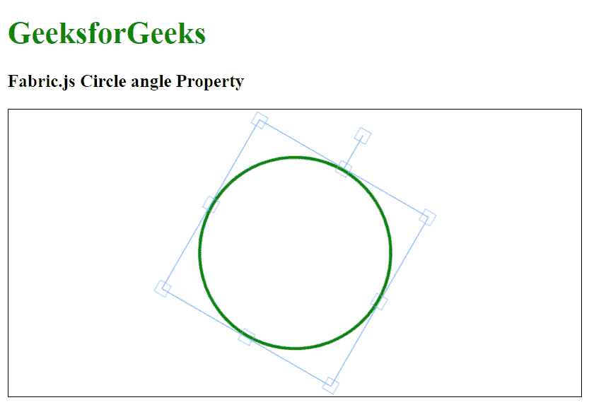

# 织物. js 圆角属性

> 原文:[https://www . geesforgeks . org/fabric-js-circle-angle-property/](https://www.geeksforgeeks.org/fabric-js-circle-angle-property/)

在本文中，我们将看到如何使用 **FabricJS** 绘制一个固定角度的画布圆。帆布圈是可移动的，可以根据需要拉伸。此外，当涉及到初始*笔画颜色、高度、宽度、填充颜色、*或*笔画宽度*时，可以自定义圆圈。

为了实现这一点，我们将使用一个名为 **FabricJS** 的 JavaScript 库。导入库后，我们将在主体标签中创建一个包含圆圈的画布块。之后，我们将初始化由 **FabricJS** 提供的画布和圆的实例，并使用 *angle* 属性启用画布圆的角度，并在画布上渲染圆，如下所示。

**语法:**

```
fabric.Circle({
   radius: number,
   angle: number
});
```

**参数:**该函数接受两个参数，如上所述，如下所述。

*   **半径:**指定圆的半径。
*   **角度:**该参数定义圆的角度。

**示例:**本示例使用 **FabricJS** 启用画布状圆圈的角度，如下所示。启用*角度*属性后，它将按定义的角度旋转圆。

## 超文本标记语言

```
<!DOCTYPE html>
<html>

<head>
     <!-- FabricJS CDN -->
    <script src=
"https://cdnjs.cloudflare.com/ajax/libs/fabric.js/3.6.2/fabric.min.js">
    </script>
</head>

<body>
    <h1 style="color: green;">
        GeeksforGeeks
    </h1>

    <h3>
        Fabric.js Circle angle Property
    </h3>

    <canvas id="canvas" width="600" height="300"
        style="border:1px solid #000000">
    </canvas>

    <script>

        // Initiate a Canvas instance 
        var canvas = new fabric.Canvas("canvas");

        // Initiate a Circle instance 
        var circle = new fabric.Circle({
            radius: 100,
            fill: '',
            stroke: 'green',
            strokeWidth: 3,
            angle: 30
        });

        // Render the circle in canvas 
        canvas.add(circle);
        canvas.centerObject(circle);
    </script>
</body>

</html>
```

**输出:**

