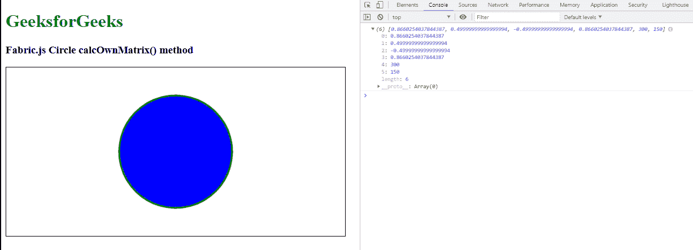

# fabric . js Circle calcOwnMatrix()方法

> 原文:[https://www . geesforgeks . org/fabric-js-circle-calcownmatrix-method/](https://www.geeksforgeeks.org/fabric-js-circle-calcownmatrix-method/)

在本文中，我们将看到如何使用 FabricJS 在画布 circle 中获取表示 Circle 对象 calcOwnMatrix()方法的当前转换的转换矩阵，它用于填充对象。画布圆意味着圆是可移动的，可以根据需要拉伸。此外，当涉及到初始笔画颜色、高度、宽度、填充颜色或笔画宽度时，可以自定义圆形。

calcOwnMatrix()方法用于获取表示圆形对象当前变换的变换矩阵。

**方法:**首先导入 fabric.js 库。导入库后，在主体标签中创建一个包含圆形的画布块。之后，初始化 Fabric 提供的 Canvas 和 Circle 类的一个实例。JS 并使用 calcOwnMatrix()方法。

**语法:**

```
circle.calcOwnMatrix()
```

**参数:**该函数不取任何参数。

**返回值:**该方法返回包含表示对象当前变换的变换矩阵的对象。

**示例:**本示例使用 FabricJS 设置画布圆的 calcOwnMatrix()方法，如下例所示:

## 超文本标记语言

```
<!DOCTYPE html> 
<html> 

<head> 

   <script src= 
"https://cdnjs.cloudflare.com/ajax/libs/fabric.js/3.6.2/fabric.min.js"> 
   </script> 
</head> 

<body> 
   <h1 style="color: green;"> 
      GeeksforGeeks 
   </h1> 

   <h3> 
      Fabric.js Circle calcOwnMatrix() method 
   </h3> 

   <canvas id="canvas" width="600" height="300"
      style="border:1px solid #000000"> 
   </canvas> 

   <script> 

      var canvas = new fabric.Canvas("canvas"); 

      var circle = new fabric.Circle({ 
         radius: 100, 
         fill: 'blue', 
         stroke: 'green', 
         strokeWidth: 3, 
         angle: 30 
      }); 

      canvas.add(circle); 
      canvas.centerObject(circle); 
      console.log(circle.calcOwnMatrix())
   </script> 
</body> 

</html>
```

**输出:**



**参考:**T2】http://fabricjs.com/docs/fabric.Circle.html#calcOwnMatrix