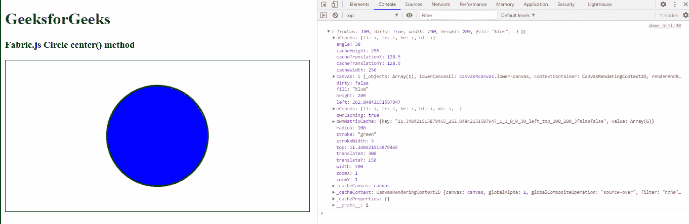

# Fabric.js 圆心()法

> 原文:[https://www . geesforgeks . org/fabric-js-circle-center-method/](https://www.geeksforgeeks.org/fabric-js-circle-center-method/)

在这篇文章中，我们将看到如何让圆心在画布上垂直和水平地指向一个圆对象的中心()方法在画布上使用 FabricJS 画圆，它用来填充一个对象。画布圆意味着圆是可移动的，可以根据需要拉伸。此外，当涉及到初始笔画颜色、高度、宽度、填充颜色或笔画宽度时，可以自定义圆形。

center()方法用于使 Centers 在圆形对象的画布上垂直和水平移动

**接近**:首先导入 fabric.js 库。导入库后，在主体标签中创建一个包含圆形的画布块。之后，初始化 Fabric 提供的 Canvas 和 Circle 类的一个实例。JS 并使用中心()方法。

**语法:**

```
circle.center()
```

**参数:**该函数不取任何参数。

**返回值:**此方法返回包含画布上垂直和水平居中对象的对象值。

**示例:**本示例使用 FabricJS 设置画布圆的 center()方法，如下例所示:

## 超文本标记语言

```
<!DOCTYPE html> 
<html> 

<head> 

   <script src= 
"https://cdnjs.cloudflare.com/ajax/libs/fabric.js/3.6.2/fabric.min.js"> 
   </script> 
</head> 

<body> 
   <h1 style="color: green;"> 
      GeeksforGeeks 
   </h1> 

   <h3> 
      Fabric.js Circle center() method 
   </h3> 

   <canvas id="canvas" width="600" height="300"
      style="border:1px solid #000000"> 
   </canvas> 

   <script> 

      var canvas = new fabric.Canvas("canvas"); 

      var circle = new fabric.Circle({ 
         radius: 100, 
         fill: 'blue', 
         stroke: 'green', 
         strokeWidth: 3, 
         angle: 30 
      }); 

      canvas.add(circle); 
      canvas.centerObject(circle); 
      console.log(circle.center())
   </script> 
</body> 

</html>
```

**输出:**



**参考:**T2】http://fabricjs.com/docs/fabric.Circle.html#center