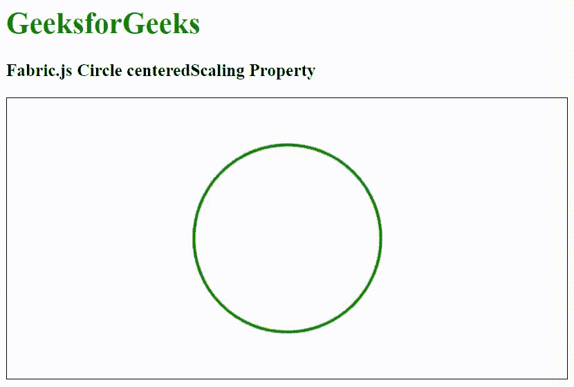

# 织物. js 圆形中心缩放属性

> 原文:[https://www . geesforgeks . org/fabric-js-circle-centered scaling-property/](https://www.geeksforgeeks.org/fabric-js-circle-centeredscaling-property/)

在本文中，我们将看到如何使用 Fabric.js 启用画布圆的居中缩放。Fabric.js 中的圆是可移动的，并且可以根据需要进行拉伸。此外，当涉及到初始笔画颜色、填充颜色、笔画宽度或大小时，可以自定义圆形。

**方法:**为了使其成为可能，我们将使用一个名为 Fabric.js 的 JavaScript 库。在使用 CDN 导入库之后，我们将在 body 标记中创建一个画布块，其中将包含我们的圆。之后，我们将初始化 Fabric.js 提供的 Canvas 和 Circle 的实例，使用 centered scaling 属性启用 Circle 的居中缩放，并在 Canvas 上渲染 Circle，如下所示。

**语法:**

```
fabric.Circle({
   radius: number,
   centeredScaling: boolean
});
```

**参数:**该函数接受两个参数，如上所述，如下所述:

*   **半径:**指定圆的半径。
*   **居中缩放:**指定是启用还是禁用居中缩放。

**示例:**该示例使用 Fabric.js 启用圆形的居中缩放，如下所示。物体将从四面均匀缩放。

## 超文本标记语言

```
<html>
<head>
    <!-- FabricJS CDN -->
    <script src=
"https://cdnjs.cloudflare.com/ajax/libs/fabric.js/3.6.2/fabric.min.js">
    </script>
</head>
<body>
    <h1 style="color: green;">
        GeeksforGeeks
    </h1>
    <h3>
        Fabric.js Circle centeredScaling Property
    </h3>
    <canvas id="canvas" width="600" height="300"
        style="border:1px solid #000000">
    </canvas>
    <script>
        // Initiate a Canvas instance 
        var canvas = new fabric.Canvas("canvas");

        // Initiate a Circle instance 
        var circle = new fabric.Circle({
            radius: 100,
            fill: '',
            stroke: 'green',
            strokeWidth: 3,
            centeredScaling: true
        });

        // Render the circle in canvas 
        canvas.add(circle);
        canvas.centerObject(circle);
    </script>
</body>
</html>
```

**输出:**

