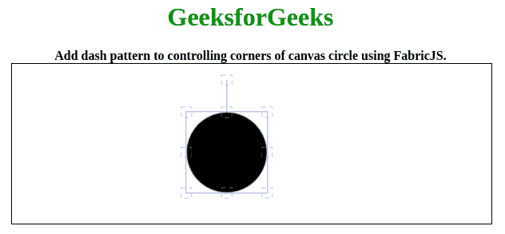

# Fabric.js |圆角阵列属性

> 原文:[https://www . geesforgeks . org/fabric-js-circle-cornerdasharray-property/](https://www.geeksforgeeks.org/fabric-js-circle-cornerdasharray-property/)

在本文中，我们将看到如何使用 FabricJS 添加一个破折号模式来控制画布圆的角。画布意味着圆是可移动的，可以根据需要拉伸。此外，当涉及到初始笔画颜色、填充颜色、笔画宽度或半径时，可以对圆进行自定义。

为了实现这一点，我们将使用一个名为 FabricJS 的 JavaScript 库。使用 CDN 导入库后，我们将在主体标签中创建一个包含我们的圆的*画布*块。之后，我们将初始化由 FabricJS 提供的 Canvas 和 Circle 的实例，并使用 **cornerDashArray** 属性为控制圆的角添加虚线图案，并在 Canvas 上渲染圆，如下例所示。

**语法:**

```
fabric.Circle({
    radius: number,
    cornerDashArray: string
}); 
```

**参数:**该函数接受两个参数，如上所述，如下所述:

*   **半径:**指定圆的半径。
*   **拐角阵列:**指定控制拐角的模式。

**示例:**本示例使用 FabricJS 向画布圆的控制角添加虚线图案。请注意，您必须单击对象才能看到图案。

```
<!DOCTYPE html>
<html>

<head>
    <title>
        Fabric.js | Circle cornerDashArray Property
    </title>

    <!-- FabricJS CDN -->
    <script src=
"https://cdnjs.cloudflare.com/ajax/libs/fabric.js/3.6.2/fabric.min.js">
    </script>
</head>

<body>
    <center>
        <h1 style="color: green;">GeeksforGeeks</h1>

        <b>
            Add dash pattern to controlling corners
            of canvas circle using FabricJS.
        </b>

        <canvas id="canvas" width="600" height="200"
            style="border:1px solid #000000">
        </canvas>

        <script>

            // Initiate a Canvas instance
            var canvas = new fabric.Canvas("canvas");

            // Initiate a Circle instance
            var circle = new fabric.Circle({
                radius: 50,
                cornerDashArray: [5]
            });

            // Render the circle in canvas
            canvas.add(circle);
        </script>
    </center>
</body>

</html>
```

**输出:**
