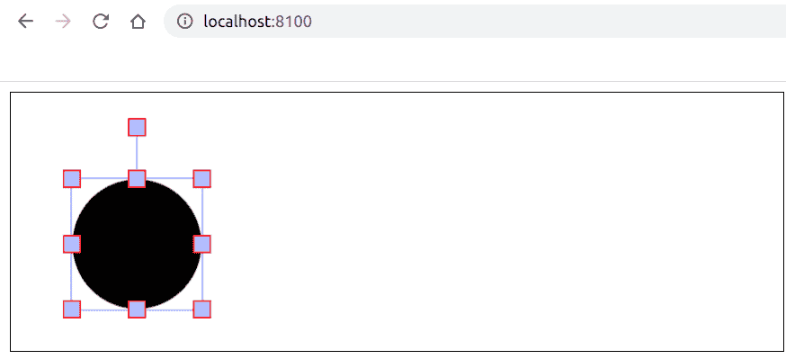

# Fabric.js |圆角颜色属性

> 原文:[https://www . geesforgeks . org/fabric-js-circle-cornerstrokecolor-property/](https://www.geeksforgeeks.org/fabric-js-circle-cornerstrokecolor-property/)

在本文中，我们将看到如何使用 FabricJS 更改画布圆圈的控制角的颜色。画布意味着圆是可移动的，可以根据需要拉伸。此外，当涉及到初始笔画颜色、填充颜色、笔画宽度或半径时，可以对圆进行自定义。

**方法:**为了使其成为可能，我们将使用一个名为 FabricJS 的 JavaScript 库。使用 CDN 导入库后，我们将在主体标签中创建一个包含我们的圆的*画布*块。之后，我们将初始化由 FabricJS 提供的 Canvas 和 Circle 实例，并使用 **cornerStrokeColor** 属性更改控制圆的角的颜色，并在 Canvas 上渲染圆，如下例所示。

**语法:**

```
fabric.Circle({
    radius: number,
    cornerStrokeColor: string,
    transparentCorners: boolean
}); 
```

**参数:**该功能接受三个参数，如上所述，描述如下:

*   **半径:**指定圆的半径。
*   **角笔画颜色:**指定控制角的笔画颜色名称。
*   **透明角:**指定我们要不要做透明角。

**示例:**本示例使用 FabricJS 更改画布圆的控制角的颜色。请注意，您必须单击对象才能看到角落。

```
<!DOCTYPE html>
<html>

<head>
    <title> 
        Fabric.js | Circle cornerStrokeColor Property
    </title>

    <!-- FabricJS CDN -->
    <script src=
"https://cdnjs.cloudflare.com/ajax/libs/fabric.js/3.6.2/fabric.min.js">
    </script>
</head>

<body>
    <canvas id="canvas" width="600" height="200" 
        style="border:1px solid #000000">
    </canvas>

    <script>

        // Initiate a Canvas instance
        var canvas = new fabric.Canvas("canvas");

        // Initiate a Circle instance
        var circle = new fabric.Circle({
            radius: 50,
            cornerStrokeColor: 'red',
            transparentCorners: false
        });

        // Render the circle in canvas
        canvas.add(circle);
    </script>
</body>

</html>
```

**输出:**
