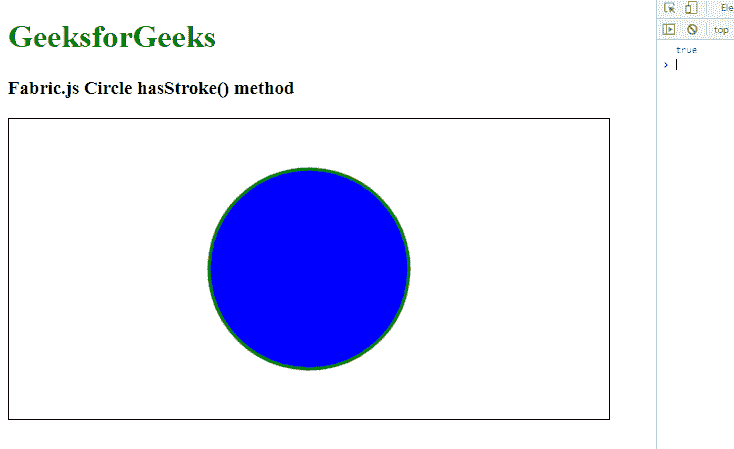

# 布艺. js 圈有行程()方法

> 原文:[https://www . geesforgeks . org/fabric-js-circle-has stuble-method/](https://www.geeksforgeeks.org/fabric-js-circle-hasstroke-method/)

在这篇文章中，我们将看到如何使用**hasstuble()**方法返回 true 如果对象将绘制一个笔画，它不考虑画布中的文本样式圆使用 **FabricJS** ，它用于填充一个对象。画布圆意味着圆是可移动的，可以根据需要拉伸。此外，当涉及到初始笔画颜色、高度、宽度、填充颜色或笔画宽度时，可以自定义圆形。

**hasstuble()**方法返回 true 如果对象将绘制一个笔画，它不考虑文本样式。

首先导入 fabric.js 库。导入库后，在主体标签中创建一个包含圆形的画布块。之后，初始化 Fabric 提供的 Canvas 和 Circle 类的一个实例。JS 并使用 **hasStroke()** 方法。

**语法**:

```html
Circle.hasStroke()
```

**参数**:本功能不取任何参数。

**返回值**:该方法返回布尔值，如果对象将绘制一个笔画，则返回 true。

**示例**:本示例使用 **FabricJS** 设置画布圆的**hasstuble()**方法，如下例所示:

## 超文本标记语言

```html
<!DOCTYPE html>
<html>
  <head>
    <script src=
"https://cdnjs.cloudflare.com/ajax/libs/fabric.js/3.6.2/fabric.min.js">
    </script>
  </head>

  <body>
    <h1 style="color: green">GeeksforGeeks</h1>

    <h3>Fabric.js Circle hasStroke() method</h3>

    <canvas
      id="canvas"
      width="600"
      height="300"
      style="border: 1px solid #000000"
    >
    </canvas>

    <script>
      var canvas = new fabric.Canvas("canvas");

      var circle = new fabric.Circle({
        radius: 100,
        fill: "blue",
        stroke: "green",
        strokeWidth: 3,
        angle: 30,
      });

      canvas.add(circle);
      canvas.centerObject(circle);
      console.log(circle.hasStroke());
    </script>
  </body>
</html>
```

**输出:**

