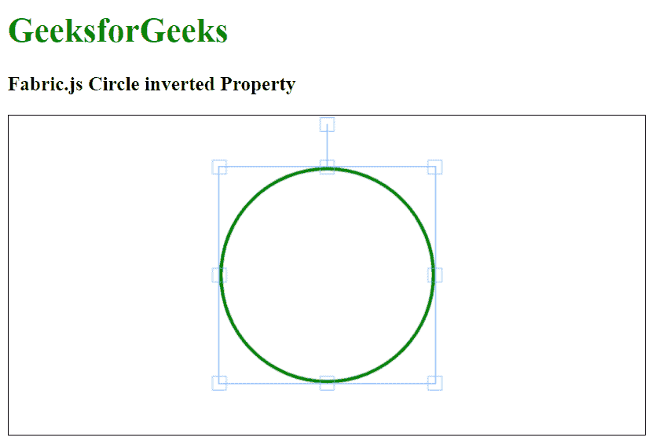

# 织物 js 圆倒属性

> 原文:[https://www . geesforgeks . org/fabric-js-circle-inverted-property/](https://www.geeksforgeeks.org/fabric-js-circle-inverted-property/)

在本文中，我们将看到如何使用 **Fabric.js** 设置圆形画布的*反转*属性。如果对象用作剪辑路径，此属性很有用。**布艺. js** 中的圆可以根据需要拉伸。此外，当涉及到初始笔划*颜色、填充颜色、笔划宽度、*或*半径*时，可以自定义圆。

为了实现这一点，我们将使用一个名为 **Fabric.js** 的 JavaScript 库。导入库后，我们将在主体标签中创建一个包含圆圈的画布块。之后，我们将初始化 **Fabric.js** 提供的画布和圆的实例，并设置圆的*反转*属性，并在画布上渲染，如下例所示。

**语法:**

```
fabric.Circle({
   radius: number,
   inverted: boolean
});
```

**参数:**该函数接受两个参数，如上所述，如下所述。

*   **半径:**指定圆的半径。
*   **反转:**是设置圆的*反转*属性的布尔值。

**示例:**本示例使用 **Fabric.js** 设置画布圆的*反转*属性。

## 超文本标记语言

```
<!DOCTYPE html>
<html>

<head>
    <!-- FabricJS CDN -->
    <script src=
"https://cdnjs.cloudflare.com/ajax/libs/fabric.js/3.6.2/fabric.min.js">
    </script>
</head>

<body>
    <h1 style="color: green;">
        GeeksforGeeks
    </h1>

    <h3>
        Fabric.js Circle inverted Property
    </h3>

    <canvas id="canvas" width="600" height="300" 
        style="border:1px solid #000000">
    </canvas>

    <script>

        // Initiate a Canvas instance 
        var canvas = new fabric.Canvas("canvas");

        // Initiate a Circle instance 
        var circle = new fabric.Circle({
            radius: 100,
            fill: '',
            stroke: 'green',
            strokeWidth: 3,
            inverted: false
        });

        // Render the circle in canvas 
        canvas.add(circle);
        canvas.centerObject(circle);
    </script>
</body>

</html>
```

**输出:**

