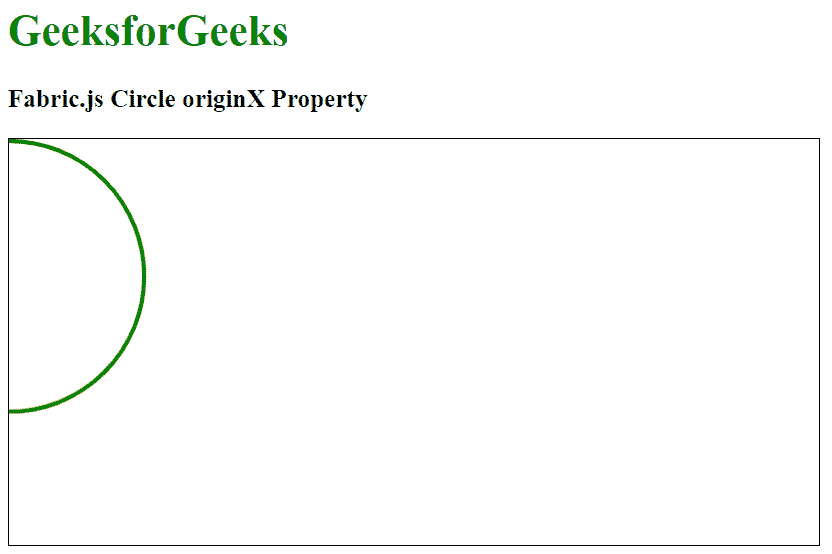

# 织物. js 圆原点属性

> 原文:[https://www . geesforgeks . org/fabric-js-circle-originx-property/](https://www.geeksforgeeks.org/fabric-js-circle-originx-property/)

在本文中，我们将看到如何使用 Fabric.js 设置对象画布圆的变换的水平原点。Fabric.js 中的圆是可移动的，可以根据需要进行拉伸。此外，当涉及到初始笔画颜色、填充颜色、笔画宽度或大小时，可以自定义圆形。

为了实现这一点，我们将使用一个名为 Fabric.js 的 JavaScript 库。导入库后，我们将在主体标签中创建一个包含 Circle 的画布块。之后，我们将初始化 Fabric.js 提供的 Canvas 和 Circle 的实例，使用 originX 属性设置 Circle 的水平变换，并在 Canvas 上渲染 Circle，如下例所示。

**语法:**

```
fabric.Circle({
   radius: number,
   originX: string
});
```

**参数:**该函数接受两个参数，如上所述，如下所述:

*   **半径:**指定圆的半径。
*   **originX:** 指定圆的水平变换。

**示例:**

## 超文本标记语言

```
<html>
<head>
    <!-- FabricJS CDN -->
    <script src=
"https://cdnjs.cloudflare.com/ajax/libs/fabric.js/3.6.2/fabric.min.js">
    </script>
</head>
<body>
    <h1 style="color: green;">
        GeeksforGeeks
    </h1>
    <h3>
        Fabric.js Circle originX Property
    </h3>
    <canvas id="canvas" width="600" height="300" 
            style="border:1px solid #000000">
    </canvas>
    <script>
        // Initiate a Canvas instance 
        var canvas = new fabric.Canvas("canvas");

        // Initiate a Circle instance 
        var circle = new fabric.Circle({
            radius: 100,
            fill: '',
            stroke: 'green',
            strokeWidth: 3,
            originX: "center"
        });

        // Render the circle in canvas 
        canvas.add(circle);
    </script>
</body>
</html>
```

**输出:**

