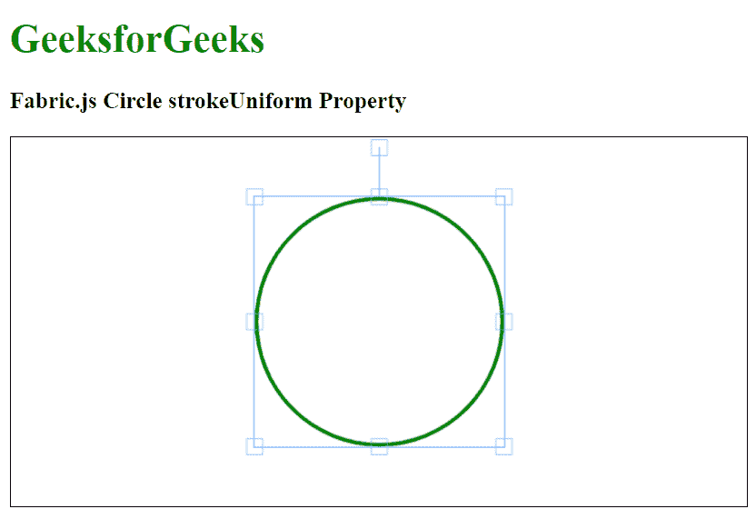

# 织物. js 圆形 stroke 均匀性

> 原文:[https://www . geesforgeks . org/fabric-js-circle-stroke uniform-property/](https://www.geeksforgeeks.org/fabric-js-circle-strokeuniform-property/)

在本文中，我们将看到如何使用 FabricJS 设置画布 Circle 的统一笔画宽度，以便即使我们将对象缩放到更大的尺寸，笔画宽度也保持不变。画布意味着圆是可移动的，可以根据需要拉伸。此外，当涉及到初始笔画颜色、填充颜色、笔画宽度或大小时，可以自定义圆形。

**进场:**

*   为了实现这一点，我们将使用一个名为 FabricJS 的 JavaScript HTML5 画布库。
*   使用 CDN 导入库后，我们将在主体标签中创建一个画布块，其中将包含我们的圆形。
*   之后，我们将初始化由 FabricJS 提供的 canvas 和 Circle 的实例，并使用 strokeUniform 属性锁定 canvas Circle 的统一笔画宽度，并在 Canvas 上渲染 Circle，如下例所示。

**语法:**

```
fabric.Circle({
   radius: number,
   strokeUniform: boolean
});
```

**参数:**该函数接受两个参数，如上所述，如下所述:

*   **半径:**指定圆的半径。
*   **笔画均匀:**指定是否锁定均匀笔画宽度。

**示例:**本示例使用 FabricJS 锁定画布 Circle 的统一笔画宽度。

## 超文本标记语言

```
<!DOCTYPE html>
<html>

<head>
    <title>
        Fabric.js Circle strokeUniform Property
    </title>

    <!-- FabricJS CDN -->
    <script src=
"https://cdnjs.cloudflare.com/ajax/libs/fabric.js/3.6.2/fabric.min.js">
    </script>
</head>

<body>
    <h1 style="color: green;">
        GeeksforGeeks
    </h1>

    <h3>
        Fabric.js Circle strokeUniform Property
    </h3>

    <canvas id="canvas" width="600" height="300"
        style="border:1px solid #000000">
    </canvas>

    <script>

        // Initiate a Canvas instance 
        var canvas = new fabric.Canvas("canvas");

        // Initiate a Circle instance 
        var circle = new fabric.Circle({
            radius: 100,
            fill: '',
            stroke: 'green',
            strokeUniform: true,
            strokeWidth: 3
        });

        // Render the circle in canvas 
        canvas.add(circle);
        canvas.centerObject(circle);
    </script>
</body>

</html>
```

**输出:**

