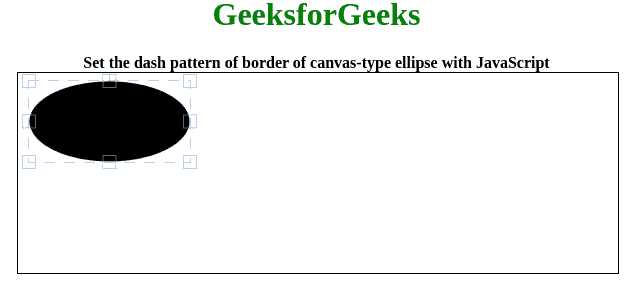

# Fabric.js |椭圆 borderDashArray 属性

> 原文:[https://www . geeksforgeeks . org/fabric-js-ellipse-bordersharray-property/](https://www.geeksforgeeks.org/fabric-js-ellipse-borderdasharray-property/)

在本文中，我们将看到如何使用 FabricJS 设置画布椭圆边框的虚线图案。画布意味着椭圆是可移动的，可以根据需要拉伸。此外，当涉及到初始笔画颜色、填充颜色、笔画宽度或半径时，可以自定义椭圆。

为了实现这一点，我们将使用一个名为 FabricJS 的 JavaScript 库。使用 CDN 导入库后，我们将在主体标签中创建一个**画布**块，它将包含我们的椭圆。之后，我们将初始化由 FabricJS 提供的 canvas 和 Ellipse 的实例，并使用**bordersharray**属性设置 Canvas 椭圆的边框的虚线图案，并在 Canvas 上渲染椭圆，如下例所示。

**语法:**

```
fabric.Ellipse({
    rx: number,
    ry: number,
    borderDashArray: array
}); 
```

**参数:**该函数接受三个参数，如上所述，如下所述:

*   **rx:** 此参数定义水平半径。
*   **ry:** 此参数定义垂直半径。
*   **边框线:**此参数定义边框的虚线图案。

**程序:**本示例使用 FabricJS 设置画布状椭圆边框的虚线图案，如下所示。请注意，您必须单击椭圆才能看到边框。

```
<!DOCTYPE html>
<html>

<head>
    <title>
        Fabric.js | Ellipse borderDashArray Property
    </title>

    <!-- Loading the FabricJS library -->
    <script src=
"https://cdnjs.cloudflare.com/ajax/libs/fabric.js/3.6.2/fabric.min.js">
    </script>
</head>

<body>
    <center>
        <h1 style="color: green;">
            GeeksforGeeks
        </h1>
        <b>
            Set the dash pattern of border of 
            canvas-type ellipse with JavaScript
        </b>
        <canvas id="canvas" width="600" height="200" 
            style="border:1px solid #000000">
        </canvas>
    </center>

    <script>

        // Initiate a Canvas instance
        var canvas = new fabric.Canvas("canvas");

        // Initiate a Ellipse instance
        var ellipse = new fabric.Ellipse({
            rx: 80,
            ry: 40,
            borderDashArray: [10]
        });

        // Render the Ellipse in canvas
        canvas.add(ellipse);
    </script>
</body>

</html>
```

**输出:**
