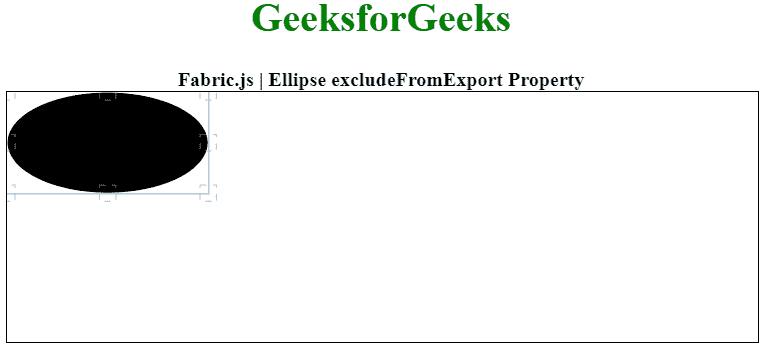

# Fabric.js 椭圆 excludeFromExport 属性

> 原文:[https://www . geesforgeks . org/fabric-js-ellipse-excludefromexport-property/](https://www.geeksforgeeks.org/fabric-js-ellipse-excludefromexport-property/)

在本文中，我们将看到如何使用 FabricJS 禁用画布椭圆的导出。画布椭圆意味着椭圆是可移动的，可以根据需要拉伸。此外，当涉及到初始笔画颜色、高度、宽度、填充颜色或笔画宽度时，可以自定义椭圆。

为了实现这一点，我们将使用一个名为 FabricJS 的 JavaScript 库。导入库后，我们将在包含椭圆的主体标签中创建一个画布块。之后，我们将初始化 FabricJS 提供的 canvas 和 Ellipse 的实例，并使用 excludeFromExport 属性禁用 canvas Ellipse 的 canvas 点击移动属性，并在 Canvas 上渲染 Rect，如下所示。

**语法:**

```
 fabric.Ellipse({
    rx: number,
    ry: number
,
    excludeFromExport: boolean
}); 
```

**参数:**该属性接受如上所述的单个参数，如下所述:

*   **exclude defromexport:**当` true '时，对象不在 OBJECT/JSON 中导出。

下面的例子说明了 Fabric.js 中的 excludeFromExport:

**示例:**

## 超文本标记语言

```
<!DOCTYPE html> 
<html> 

<head> 
    <!-- Loading the FabricJS library -->
    <script src= 
"https://cdnjs.cloudflare.com/ajax/libs/fabric.js/3.6.2/fabric.min.js"> 
    </script> 
</head> 

<body> 
    <center> 
        <h1 style="color: green;"> 
            GeeksforGeeks 
        </h1> 

        <b> 
         Fabric.js | Ellipse excludeFromExport Property 
        </b> 
        <canvas id="canvas" width="600" height="200"
            style="border:1px solid #000000"> 
        </canvas> 
    </center> 

    <script> 

        // Initiate a Canvas instance 
        var canvas = new fabric.Canvas("canvas"); 

        // Initiate a Ellipse instance 
        var ellipse = new fabric.Ellipse({ 
            rx: 80, 
            ry: 40, 
            cornerDashArray: [5],
            excludeFromExport: 'false'
        }); 

        // Render the Ellipse in canvas 
        canvas.add(ellipse); 
    </script> 
</body> 

</html>
```

**输出:**

