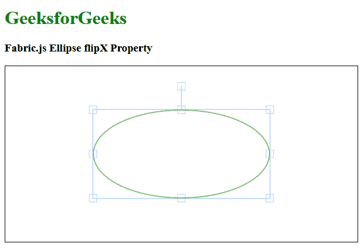

# Fabric.js 椭圆 flipX 属性

> 原文:[https://www . geesforgeks . org/fabric-js-ellips-flipx-property/](https://www.geeksforgeeks.org/fabric-js-ellipse-flipx-property/)

在本文中，我们将看到如何使用 FabricJS 水平翻转椭圆画布。画布椭圆意味着椭圆是可移动的，可以根据需要拉伸。此外，当涉及到初始笔画颜色、高度、宽度、填充颜色或笔画宽度时，可以自定义椭圆。

**进场:**

*   为了实现这一点，我们将使用一个名为 FabricJS 的 JavaScript HTML5 画布库。
*   导入库后，我们将在包含椭圆的主体标签中创建一个画布块。
*   在此之后，我们将初始化由 FabricJS 提供的 canvas 和 ellips 的实例，并使用 flipX 属性设置 canvas Ellipse 的 flipX，并在 Canvas 上渲染 ellips，如下例所示。

**语法:**

```
fabric.Ellipse({
   rx: number,
   ry: number,
   fill: string,
   flipX: Boolean
});
```

**参数:**该功能接受四个参数，如上所述，描述如下:

*   **rx:** 指定水平半径。
*   **ry:** 指定垂直半径。
*   **填充:**指定填充椭圆的颜色。
*   **flipX:** 指定对象水平翻转。

**示例:**本示例使用 FabricJS 水平翻转画布椭圆。

## 超文本标记语言

```
<!DOCTYPE html>
<html>

<head>
    <title>
        Fabric.js Ellipse flipX Property
    </title>

    <!-- FabricJS CDN -->
    <script src=
"https://cdnjs.cloudflare.com/ajax/libs/fabric.js/3.6.2/fabric.min.js">
    </script>
</head>

<body>
    <h1 style="color: green;">
        GeeksforGeeks
    </h1>

    <h3>
        Fabric.js Ellipse flipX Property
    </h3>

    <canvas id="canvas" width="600" height="300" 
        style="border:1px solid #000000">
    </canvas>

    <script>

        // Initiate a Canvas instance 
        var canvas = new fabric.Canvas("canvas");

        // Initiate a Ellipse instance 
        var ellipse = new fabric.Ellipse({
            rx: 150,
            ry: 75,
            fill: '',
            stroke: 'green',
            flipX: true
        });

        // Render the ellipse in canvas 
        canvas.add(ellipse);
        canvas.centerObject(ellipse);
    </script>
</body>

</html>
```

**输出:**

