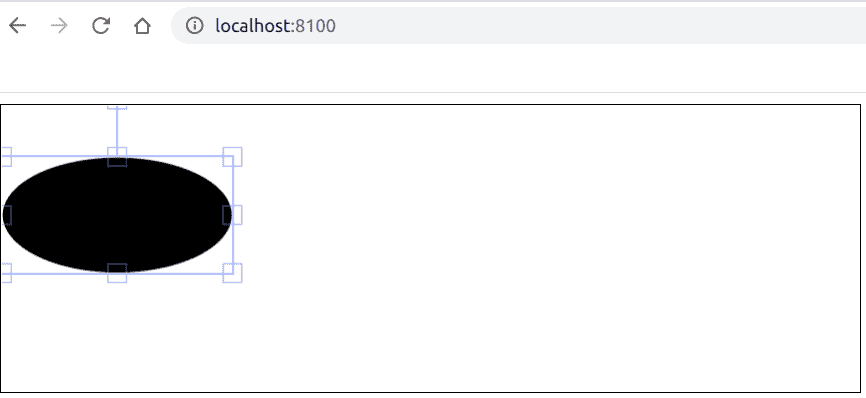

# 织物. js |椭圆锁定旋转属性

> 原文:[https://www . geesforgeks . org/fabric-js-ellips-lock rotation-property/](https://www.geeksforgeeks.org/fabric-js-ellipse-lockrotation-property/)

在本文中，我们将看到如何使用 FabricJS 锁定画布椭圆的旋转。画布意味着椭圆是可移动的，可以根据需要拉伸。此外，当涉及到初始笔画颜色、填充颜色、笔画宽度或半径时，可以自定义椭圆。

**方法:**为了使其成为可能，我们将使用一个名为 FabricJS 的 JavaScript 库。使用 CDN 导入库后，我们将在主体标签中创建一个包含我们的椭圆的*画布*块。之后，我们将初始化 FabricJS 提供的 canvas 和 Ellipse 实例，并使用**锁定旋转**属性锁定 Canvas 椭圆的旋转，并在 Canvas 上渲染椭圆，如下例所示。

**语法:**

```
fabric.Ellipse({
    rx: number,
    ry: number,
    lockRotation: boolean
}); 
```

**参数:**该功能接受三个参数，如上所述，描述如下:

*   **rx:** 指定水平半径。
*   **ry:** 指定垂直半径。
*   **锁定旋转:**指定是否锁定画布的旋转。

**程序:**本示例使用 FabricJS 锁定画布状椭圆的旋转，如下所示。

```
<!DOCTYPE html>
<html>

<head>
    <title>
        Fabric.js | Ellipse lockRotation Property
    </title>

    <!-- Loading the FabricJS library -->
    <script src=
"https://cdnjs.cloudflare.com/ajax/libs/fabric.js/3.6.2/fabric.min.js">
    </script>
</head>

<body>
    <canvas id="canvas" width="600" height="200" 
            style="border:1px solid #000000">
    </canvas>

    <script>

        // Initiate a Canvas instance
        var canvas = new fabric.Canvas("canvas");

        // Initiate a Ellipse instance
        var ellipse = new fabric.Ellipse({
            rx: 80,
            ry: 40,
            lockRotation: true
        });

        // Render the Ellipse in canvas
        canvas.add(ellipse);
    </script>
</body>

</html>
```

**输出:**
