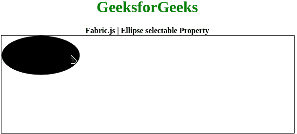

# 织物. js |椭圆可选属性

> 原文:[https://www . geesforgeks . org/fabric-js-ellipse-selected-property/](https://www.geeksforgeeks.org/fabric-js-ellipse-selectable-property/)

在本文中，我们将看到如何使用 FabricJS 禁用画布椭圆的可选择性。画布意味着椭圆是可移动的，可以根据需要拉伸。此外，当涉及到初始笔画颜色、填充颜色、笔画宽度或半径时，可以自定义椭圆。

为了实现这一点，我们将使用一个名为 FabricJS 的 JavaScript 库。使用 CDN 导入库后，我们将在主体标签中创建一个**可选的**块，它将包含我们的椭圆。之后，我们将初始化由 FabricJS 提供的画布和椭圆的实例，并使用**可选**属性禁用画布椭圆的可选性，并在画布上渲染椭圆，如下例所示。

**语法:**

```
fabric.Ellipse({
    rx: number,
    ry: number,
    selectable: boolean
}); 
```

**参数:**该功能接受三个参数，如上所述，描述如下:

*   **rx:** 指定水平半径。
*   **ry:** 指定垂直半径。
*   **可选:**该参数指定是启用还是禁用可选性。

**示例:**本示例使用 FabricJS 设置禁用画布椭圆的可选择性。

```
<!DOCTYPE html>
<html>

<head>
    <title> 
        Fabric.js | Ellipse selectable Property
    </title>

    <!-- FabricJS CDN -->
    <script src=
"https://cdnjs.cloudflare.com/ajax/libs/fabric.js/3.6.2/fabric.min.js">
    </script>
</head>

<body>
    <div style="text-align: center;width: 600px;">
        <h1 style="color: green;">
            GeeksforGeeks
        </h1>
        <b>
            Fabric.js | Ellipse selectable Property
        </b>
    </div>

    <div style="text-align: center;">
    <canvas id="canvas" width="600" height="200" 
            style="border:1px solid #000000;">
    </canvas>
    </div>

    <script>
        // Initiate a Canvas instance
        var canvas = new fabric.Canvas("canvas");

        // Initiate a Ellipse instance
        var ellipse = new fabric.Ellipse({
            rx: 80,
            ry: 40,
            selectable: false
        });

        // Render the Ellipse in canvas
        canvas.add(ellipse);
    </script>
</body>

</html>                   
```

**输出:**
