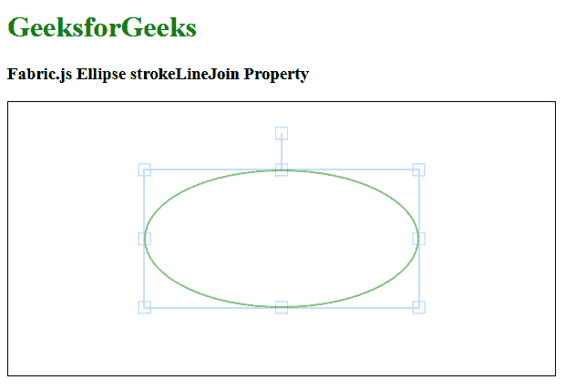

# 织物椭圆 strokeLineJoin 属性

> 原文:[https://www . geesforgeks . org/fabric-js-ellipse-strokinejoin-property/](https://www.geeksforgeeks.org/fabric-js-ellipse-strokelinejoin-property/)

在本文中，我们将看到如何使用 FabricJS 设置画布椭圆的笔画线条连接。画布意味着椭圆是可移动的，可以根据需要拉伸。此外，当涉及到初始笔画颜色、填充颜色、笔画宽度或大小时，可以自定义椭圆。

**方法:**为了实现这一点，我们将使用一个名为 FabricJS 的 JavaScript 库。使用 CDN 导入库后，我们将在主体标签中创建一个画布块，其中将包含我们的椭圆。之后，我们将初始化由 FabricJS 提供的 canvas 和 Ellipse 的实例，并使用 strokeUniform 属性设置 canvas Ellipse 的 strokeLineJoin 值，并在 Canvas 上渲染 Ellipse，如下例所示。

**语法:**

```
fabric.Ellipse({
   rx: number,
   ry: number,
   fill: string,
   strokeLineJoin: string
});
```

**参数:**该功能接受三个参数，如上所述，描述如下:

*   **rx:** 指定水平半径。
*   **ry:** 指定垂直半径。
*   **填充:**指定填充椭圆的颜色。
*   **strokeLineJoin:** 指定 strokeLineJoin 的值。

**示例:**本示例使用 FabricJS 设置 strokeLineJoin 属性的值。T2 他接受这个参数的值是斜面，圆形和斜接。

## 超文本标记语言

```
<!DOCTYPE html>
<html>

<head>
    <title>
        Fabric.js Ellipse strokeLineJoin Property
    </title>

    <!-- FabricJS CDN -->
    <script src=
"https://cdnjs.cloudflare.com/ajax/libs/fabric.js/3.6.2/fabric.min.js">
    </script>
</head>

<body>
    <h1 style="color: green;">
        GeeksforGeeks
    </h1>

    <h3>
        Fabric.js Ellipse strokeLineJoin Property
    </h3>

    <canvas id="canvas" width="600" height="300"
        style="border:1px solid #000000">
    </canvas>

    <script>
        // Initiate a Canvas instance
        var canvas = new fabric.Canvas("canvas");

        // Initiate a Ellipse instance
        var ellipse = new fabric.Ellipse({
            rx: 150,
            ry: 75,
            fill: '',
            stroke: 'green',
            strokeLineJoin: 'miter'
        });

        // Render the ellipse in canvas
        canvas.add(ellipse);
        canvas.centerObject(ellipse);
    </script>
</body>

</html>
```

**输出:**

