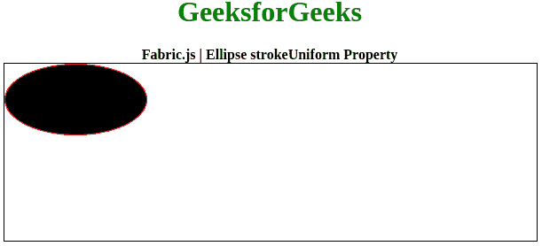

# 织物. js |椭圆 stroke 均匀性

> 原文:[https://www . geesforgeks . org/fabric-js-ellipse-stroke uniform-property/](https://www.geeksforgeeks.org/fabric-js-ellipse-strokeuniform-property/)

在本文中，我们将看到如何在使用 FabricJS 缩放画布椭圆时锁定笔画宽度。画布意味着椭圆是可移动的，可以根据需要拉伸。此外，当涉及到初始笔画颜色、填充颜色、笔画宽度或半径时，可以自定义椭圆。

为了实现这一点，我们将使用一个名为 FabricJS 的 JavaScript 库。使用 CDN 导入库后，我们将在主体标签中创建一个**画布**块，它将包含我们的椭圆。之后，我们将初始化由 FabricJS 提供的 canvas 和 Ellipse 实例，并在使用 **strokeUniform** 属性缩放 Canvas 椭圆时锁定笔画宽度，并在 Canvas 上渲染椭圆，如下例所示。

**语法:**

```
fabric.Ellipse({
    rx: number,
    ry: number,
    stroke: string,
    strokeUniform: boolean
}); 
```

**参数:**该功能接受四个参数，如上所述，描述如下:

*   **rx:** 指定水平半径。
*   **ry:** 指定垂直半径。
*   **笔画:**指定笔画颜色。
*   **strokeUniform:** 指定缩放时是否锁定笔画宽度。

**示例:**本示例使用 FabricJS 在缩放画布椭圆时锁定笔画宽度。

```
<!DOCTYPE hyml>
<html>

<head>
    <title> 
        Fabric.js | Ellipse strokeUniform Property
    </title>

    <!-- FabricJS CDN -->
    <script src=
"https://cdnjs.cloudflare.com/ajax/libs/fabric.js/3.6.2/fabric.min.js">
    </script>
</head>

<body>
    <div style="text-align: center;width: 600px;">
        <h1 style="color: green;">
            GeeksforGeeks
        </h1>
        <b>
            Fabric.js | Ellipse strokeUniform Property
        </b>
    </div>

    <div style="text-align: center;">
    <canvas id="canvas" width="600" height="200"
            style="border:1px solid #000000;">
    </canvas>
    </div>

    <script>
        // Initiate a Canvas instance
        var canvas = new fabric.Canvas("canvas");

        // Initiate a Ellipse instance
        var ellipse = new fabric.Ellipse({
            rx: 80,
            ry: 40,
            stroke: 'red',
            strokeUniform: true
        });

        // Render the Ellipse in canvas
        canvas.add(ellipse);
    </script>
</body>

</html>                   
```

**输出:**
