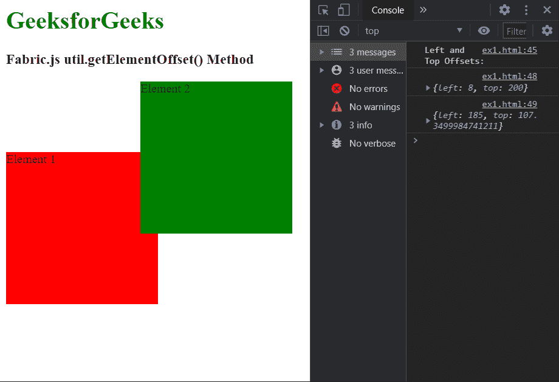

# Fabric.js getElementOffset()方法

> 原文:[https://www . geesforgeks . org/fabric-js-getelementoffset-method/](https://www.geeksforgeeks.org/fabric-js-getelementoffset-method/)

Fabric.js 中的 **getElementOffset()方法**用于查找元素的偏移量。此方法返回的对象包含“top”和“left”属性，分别表示元素的“top”和“left”偏移量。必须首先选择页面中的 HTML 元素，才能将其传递给此方法。

**语法:**

```
getElementOffset(element)
```

**参数:**该方法接受如上所述的单个参数，如下所述:

*   **元素:**该参数用于指定需要找到偏移量的 HTML 元素。

**返回值:**这个方法返回一个包含“顶部”和“左侧”偏移作为属性的对象。

下面的例子演示了 **getElementOffset()** 方法 Fabric.js:

**示例:**

## 超文本标记语言

```
<html>
<head>
  <!-- Adding the Fabric.js library -->
  <script src=
"https://cdnjs.cloudflare.com/ajax/libs/fabric.js/3.6.2/fabric.min.js">
  </script>
  <style>
    /* Define the CSS classes to be used */
    .box1 {
      width: 200px;
      height: 200px;
      background-color: red;

      position: absolute;
      top: 200px;
    }

    .box2 {
      width: 200px;
      height: 200px;
      background-color: green;

      position: absolute;
      left: 185px;
    }
  </style>
</head>

<body>
  <h1 style="color: green;">
    GeeksforGeeks
    </h1>

  <h3>
    Fabric.js util.getElementOffset() Method
    </h3>

  <div class="box1">
    Element 1
    </div>

  <div class="box2">
    Element 2
    </div>

  <script>
    // Select the elements to be used
    let elem = 
    document.querySelector('.box1');
    let elem2 = 
    document.querySelector('.box2');

    console.log("Left and Top Offsets:")

    // Find the offsets of the element
    console.log(
      fabric.util.getElementOffset(elem)
    );
    console.log(
      fabric.util.getElementOffset(elem2)
    );
  </script>
</body>

</html>
```

**输出:**

