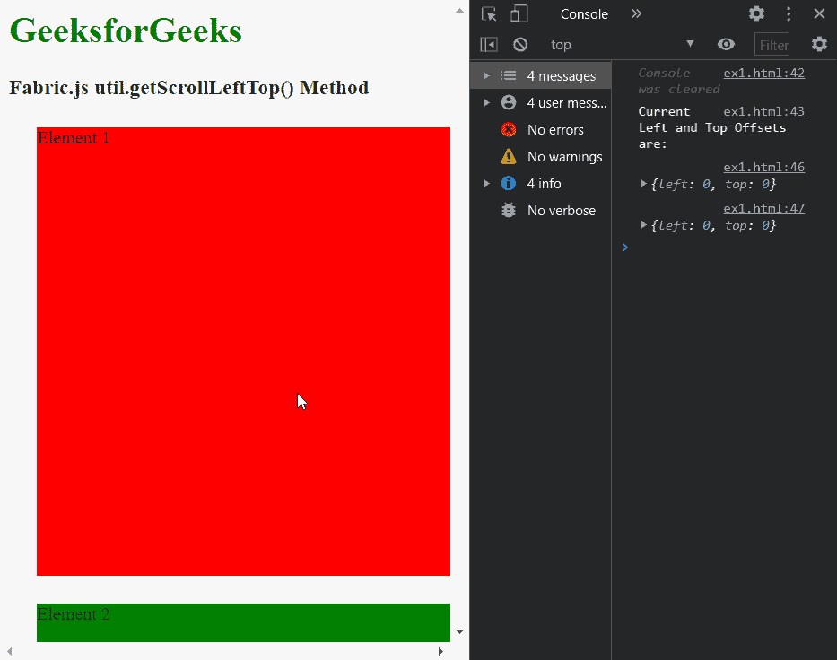

# fabric . js getscrolleftop()方法

> 原文:[https://www . geesforgeks . org/fabric-js-getscrolleftop-method/](https://www.geeksforgeeks.org/fabric-js-getscrolllefttop-method/)

Fabric.js 中的**getscrolleftop()方法**用于查找元素的滚动偏移量。此方法返回的对象包含“顶部”和“左侧”属性，分别表示“顶部”和“左侧”偏移。必须首先选择页面中的 HTML 元素才能传递此方法。

**语法:**

```
getScrollLeftTop(element)
```

**参数:**该方法接受如上所述的单个参数，如下所述:

*   **元素:**该参数用于指定需要找到滚动偏移量的 HTML 元素。

**返回值:**这个方法返回一个包含“顶部”和“左侧”滚动偏移量作为属性的对象。

下面的例子演示了**方法 Fabric.js:**

**示例:**

## 超文本标记语言

```
<html>

<head>
    <!-- Adding the Fabric.js library -->
    <script src=
"https://cdnjs.cloudflare.com/ajax/libs/fabric.js/3.6.2/fabric.min.js">
    </script>

    <style>

        /* Define the CSS classes to be used */
        .box1 {
            margin: 25px;
            width: 400px;
            height: 400px;
            background-color: red;
        }

        .box2 {
            margin: 25px;
            width: 700px;
            height: 300px;
            background-color: green;
        }
    </style>
</head>

<body>
    <h1 style="color: green;">
        GeeksforGeeks
    </h1>

    <h3>
        Fabric.js util.getScrollLeftTop() Method
    </h3>

    <div class="box1">
        Element 1
    </div>

    <div class="box2">
        Element 2
    </div>

    <script>

        // Select the elements to be used
        let elem =
            document.querySelector('.box1');
        let elem2 =
            document.querySelector('.box2');

        function getScrollOffsets() {
            console.clear();
            console.log(
                "Current Left and Top Offsets are:"
            );

            // Find the scrolled left and top offsets
            console.log(
                fabric.util.getScrollLeftTop(elem)
            );
            console.log(
                fabric.util.getScrollLeftTop(elem2)
            );
        }

        // Repeatedly call the function
        // to observe the values
        setInterval(getScrollOffsets, 1000);
    </script>
</body>

</html>
```

**输出:**

