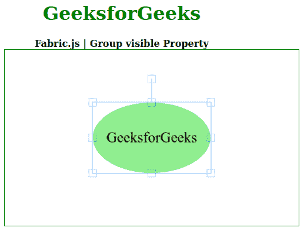
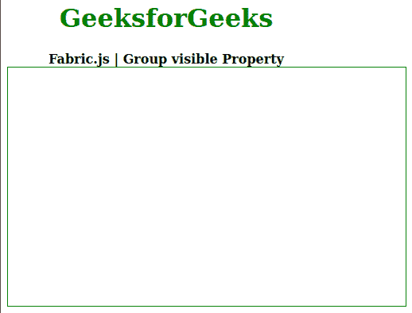

# 织物 js 组可见属性

> 原文:[https://www . geesforgeks . org/fabric-js-group-visible-property/](https://www.geeksforgeeks.org/fabric-js-group-visible-property/)

在本文中，我们将看到如何使用 **Fabric.js** 设置画布的**组**的**可见**。Fabric.js 中的组是可移动的，可以根据需要拉伸。此外，当涉及到初始笔画颜色、高度、宽度、填充颜色或笔画宽度时，可以自定义该组。

为了实现这一点，我们将使用一个名为 **Fabric.js** 的 JavaScript 库。导入库后，我们将在包含组的主体标签中创建画布块。之后，我们将初始化由 **Fabric.js** 提供的画布和组的实例，并使用**可见的**属性设置画布组的可见性。

**语法:**

```
fabric.Group([canvas1, canvas2], {
   visible: Boolean
});
```

参数:该属性接受一个参数，如上所述，如下所述:

*   **可见:**指定对象的可见性。

以下示例说明了在 JavaScript 中使用 Fabric.js 组**可见的**属性:

## 超文本标记语言

```
<!DOCTYPE html>
<html>

<head>
  <!-- FabricJS CDN -->
  <script src=
"https://cdnjs.cloudflare.com/ajax/libs/fabric.js/3.6.2/fabric.min.js">
  </script>

</head>

<body>
    <div style="text-align: center;width: 400px;">
      <h1 style="color: green;">
          GeeksforGeeks
      </h1>
      <b>
          Fabric.js | Group visible Property
      </b>
    </div>

    <div style="text-align: center;">
      <canvas id="canvas" width="500" height="300"
      style="border:1px solid green;">
      </canvas>
    </div>

    <script>
      // Initiate a Canvas instance
      var canvas = new fabric.Canvas("canvas");

      // Initiate a circle instance
      var circle = new fabric.Circle({
        radius: 100,
        fill: 'lightgreen',
        scaleY: 0.6,
        originX: 'center',
        originY: 'center'
      });

      // Initiate a text instance
      var text = new fabric.Text('GeeksforGeeks', {
        fontSize: 25,
        originX: 'center',
        originY: 'center'
      });

      // Initiate a Group instance
      var group = new fabric.Group([ circle, text ], {
          visible: true
      });

      // Render the Group in canvas
      canvas.add(group);

      // Center the Group in canvas
      canvas.centerObject(group);
  </script>
</body>

</html>
```

**输出:**



**例 2:**

## 超文本标记语言

```
<!DOCTYPE html>
<html>

<head>
  <!-- FabricJS CDN -->
  <script src=
"https://cdnjs.cloudflare.com/ajax/libs/fabric.js/3.6.2/fabric.min.js">
  </script>

</head>

<body>
    <div style="text-align: center;width: 400px;">
      <h1 style="color: green;">
          GeeksforGeeks
      </h1>
      <b>
          Fabric.js | Group visible Property
      </b>
    </div>

    <div style="text-align: center;">
      <canvas id="canvas" width="500" height="300"
      style="border:1px solid green;">
      </canvas>
    </div>

    <script>
      // Initiate a Canvas instance
      var canvas = new fabric.Canvas("canvas");

      // Initiate a circle instance
      var circle = new fabric.Circle({
        radius: 100,
        fill: 'lightgreen',
        scaleY: 0.6,
        originX: 'center',
        originY: 'center'
      });

      // Initiate a text instance
      var text = new fabric.Text('GeeksforGeeks', {
        fontSize: 25,
        originX: 'center',
        originY: 'center'
      });

      // Initiate a Group instance
      var group = new fabric.Group([ circle, text ], {
          visible: false
      });

      // Render the Group in canvas
      canvas.add(group);

      // Center the Group in canvas
      canvas.centerObject(group);
  </script>
</body>

</html>
```

**输出:**

