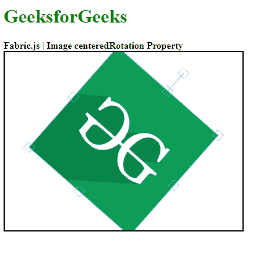

# 织物. js 图像中心站属性

> 原文:[https://www . geeksforgeeks . org/fabric-js-image-centereprotation-property/](https://www.geeksforgeeks.org/fabric-js-image-centeredrotation-property/)

**Fabric.js** 是一个用来处理画布的 javascript 库。画布图像是用于创建图像实例的 fabric.js 类之一。画布图像意味着图像是可移动的，可以根据需要拉伸。图像的中心旋转属性用于沿着中心(即原点)旋转画布图像。

**方法:**首先导入 fabric.js 库。导入库后，在主体标签中创建一个包含图像的画布块。之后，初始化一个由 Fabric 提供的 Canvas 和 image 类的实例。JS 并将 centeredRotation 属性首先设置为 false，然后设置为 true，并尝试在控件的帮助下旋转图像。然后将图像实例渲染到画布上，并将元素居中。

**语法:**

```
fabric.Image(image, {
    centeredRotation:Boolean
});

```

**参数:**上述函数取两个参数，如上所述，描述如下:

*   **图像:**该参数取图像。
*   **居中旋转:**此参数定义是启用还是禁用画布图像的居中旋转。

**示例 1:** 本示例使用 FabricJS 启用画布图像的居中旋转。图像的旋转是沿着原点的，如下例所示。

```
<!DOCTYPE html> 
<html> 

<head> 
    <!-- Adding the FabricJS library --> 
    <script src= 
"https://cdnjs.cloudflare.com/ajax/libs/fabric.js/3.6.2/fabric.min.js"> 
    </script> 
</head> 

<body> 
    <h1 style="color: green;">GeeksforGeeks</h1>
    <b>Fabric.js | Image centeredRotation Property </b>  

    <canvas id="canvas" width="300" height="250"
        style="border:2px solid #000000"> 
    </canvas> 

    
    <br>

    <button onclick="func()">Clickme</button>

    <script> 
        // Create the instance of canvas object
        var canvas = new fabric.Canvas("canvas"); 

        // Getting the image
        var img= document.getElementById('my-image');

        // Creating the image instance 
        var imgInstance = new fabric.Image(img, {
            centeredRotation:true
        });

        // Rendering the image to canvas
        canvas.add(imgInstance);
        canvas.centerObject(imgInstance);
    </script> 
</body> 

</html>
```

**输出:**



**例 2:**

```
<!DOCTYPE html> 
<html> 

<head> 
    <!-- Adding the FabricJS library --> 
    <script src= 
"https://cdnjs.cloudflare.com/ajax/libs/fabric.js/3.6.2/fabric.min.js"> 
    </script> 
</head> 

<body> 
    <h1 style="color: green;">GeeksforGeeks</h1> 
    <b>Fabric.js | Image centeredRotation Property </b> 

    <canvas id="canvas" width="300" height="300"
        style="border:2px solid #000000"> 
    </canvas> 

    
    <br>

    <button onclick="func()">Clickme</button>

    <script> 
        // Create the instance of canvas object
        var canvas = new fabric.Canvas("canvas"); 

        // Getting the image
        var img= document.getElementById('my-image');

        // Creating the image instance 
        var imgInstance = new fabric.Image(img, {
            centeredRotation:false
        });

        // Rendering the image to canvas
        canvas.add(imgInstance);

        func=()=>{
            var imgInstance = new fabric.Image(img, {
                centeredRotation:true
            });

            // Rendering the image to canvas
            canvas.add(imgInstance);
            canvas.clear();
            canvas.add(imgInstance);
        }
    </script> 
</body> 

</html>
```

**输出:**

