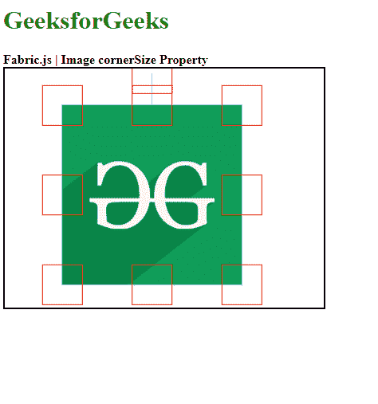

# 织物. js 图像角尺寸属性

> 原文:[https://www . geesforgeks . org/fabric-js-image-corner size-property/](https://www.geeksforgeeks.org/fabric-js-image-cornersize-property/)

**Fabric.js** 是一个用来处理画布的 javascript 库。画布图像是用于创建图像实例的 fabric.js 类之一。画布图像意味着图像是可移动的，可以根据需要拉伸。图像的 cornerSize 属性用于更改画布图像的控制角的大小。

**方法:**首先导入 fabric.js 库。导入库后，在主体标签中创建一个包含图像的画布块。之后，初始化一个由 Fabric 提供的 Canvas 和 image 类的实例。JS 并使用图像对象的 cornerSize 属性更改画布图像的控制角的大小。

**语法:**

```
fabric.Image(image, {
    cornerSize:Number
});

```

**参数:**上述函数取两个参数，如上所述，描述如下:

*   **图像:**该参数取图像。
*   **角尺寸:**此参数定义画布图像的控制角的尺寸。

**示例:**本示例使用 FabricJS 更改画布图像的控制角的大小，如下例所示。

```
<!DOCTYPE HTML> 
<html> 

<head> 
    <!-- Adding the FabricJS library --> 
    <script src= 
"https://cdnjs.cloudflare.com/ajax/libs/fabric.js/3.6.2/fabric.min.js"> 
    </script> 
</head> 

<body> 
    <h1 style="color: green;">GeeksforGeeks</h1> 
    <b>Fabric.js | Image cornerSize Property </b> 

    <canvas id="canvas" width="400" height="300"
        style="border:2px solid #000000"> 
    </canvas> 

    

    <script> 

        // Create the instance of canvas object
        var canvas = new fabric.Canvas("canvas"); 

        // Getting the image
        var img= document.getElementById('my-image');

        // Creating the image instance 
        var imgInstance = new fabric.Image(img, {
            cornerColor:"red",

            // Using cornerSize property
            cornerSize:50
        });

        // Rendering the image to canvas
        canvas.add(imgInstance);
    </script> 
</body> 

</html>
```

**输出:**

