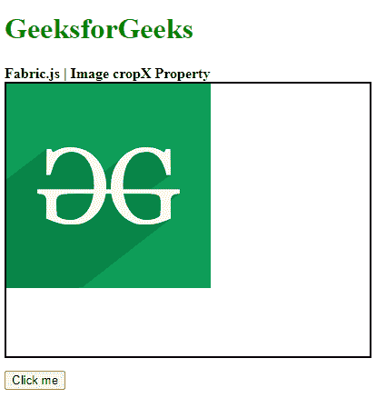
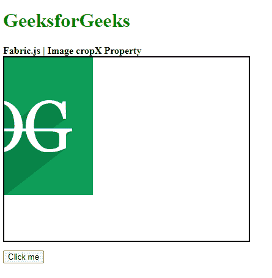

# Fabric.js Image cropX 属性

> 原文:[https://www . geesforgeks . org/fabric-js-image-cropx-property/](https://www.geeksforgeeks.org/fabric-js-image-cropx-property/)

**Fabric.js** 是一个用来处理画布的 javascript 库。画布图像是用于创建图像实例的 fabric.js 类之一。画布图像意味着图像是可移动的，可以根据需要拉伸。图像的 cropX 属性用于裁剪一定数量的画布图像。尺寸以像素为单位。

**方法:**首先导入 fabric.js 库。导入库后，在主体标签中创建一个包含图像的画布块。之后，初始化一个由 Fabric 提供的 Canvas 和 image 类的实例。JS，并使用图像对象的 cropX 属性给出画布图像的裁剪宽度(以像素为单位)。

**语法:**

```
fabric.Image(image, {
    cropX:Number
});
```

**参数:**上述函数取两个参数，如上所述，描述如下:

*   **图像:**该参数取图像。
*   **cropX:** 此参数是图像原始大小的图像裁剪量(以像素为单位)。

**示例:**本示例使用 FabricJS 沿着 x 轴裁剪画布图像的部分，如下例所示。

```

<!DOCTYPE html> 
<html> 

<head> 
    <!-- Adding the FabricJS library --> 
    <script src= 
"https://cdnjs.cloudflare.com/ajax/libs/fabric.js/3.6.2/fabric.min.js"> 
    </script> 
</head> 

<body> 
    <h1 style="color: green;">GeeksforGeeks</h1> 
    <b>Fabric.js | Image cropX Property </b> 

    <canvas id="canvas" width="400" height="300"
        style="border:2px solid #000000"> 
    </canvas> 

    <br>

    <button onclick="cropX()">Click me</button>

    <script> 

        // Create the instance of canvas object
        var canvas = new fabric.Canvas("canvas"); 

        // Getting the image
        var img= document.getElementById('my-image');

        // Creating the image instance 
        var imgInstance = new fabric.Image(img, {
        });
        function cropX() {
            imgInstance = new fabric.Image(img, {
                cropX:80
            });
            canvas.clear();
            canvas.add(imgInstance);
        }

        // Rendering the image to canvas
        canvas.add(imgInstance);
    </script> 
</body> 

</html>
```

**输出:**

**点击按钮前:**



**点击按钮后:**

